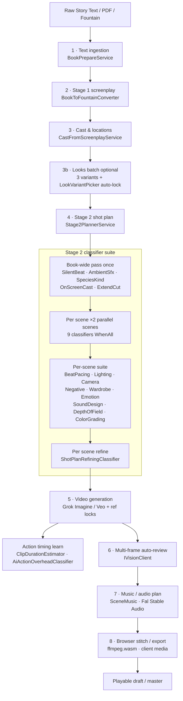

# Nick and Me / Film Studio

AI film pipeline: book or screenplay → cast locks → shot plan → Grok video → review → WIP movie.

**Product runtime is .NET only** (Blazor UI + C# API/engine under `host/`).  
No Python runtime is required.

## Run (Film Studio)

Needs:

- .NET SDK (solution targets `net10.0`)
- `XAI_API_KEY` for real Stage 1 / images / video / vision (optional fakes for UI soaks)
- A modern browser for **client** media tools (Chrome/Edge preferred): stitch, silence trim, auto-review frames use **ffmpeg.wasm** in the browser — the API host does **not** install or spawn native ffmpeg

### 1) API / engine (`http://127.0.0.1:5088`)

```powershell
cd host
$env:PageToMovie__WorkspaceRoot = (Resolve-Path ..).Path
$env:PageToMovie__UseFakes = "false"   # "true" for no xAI spend
$env:XAI_API_KEY = "your-key"         # required when UseFakes=false
$env:ASPNETCORE_URLS = "http://127.0.0.1:5088"
dotnet run --project PageToMovie.Api
```

Health: `GET http://127.0.0.1:5088/health`

### 2) Blazor UI (`http://localhost:5079`)

```powershell
cd host
$env:EngineApi__BaseUrl = "http://127.0.0.1:5088"
$env:ASPNETCORE_URLS = "http://localhost:5079"
dotnet run --project PageToMovie.Web
```

Open the UI (admin learning, cast, scenes, review).  
You need **both** Api and Web. If only Web is running, API calls fail.

### Visual Studio

Open `host/PageToMovie.slnx`, set **multiple startup projects**: Api + Web.

More detail: **`host/README.md`**.

## Layout

| Path | Role |
|------|------|
| `host/` | **Film Studio** — Api, Web, Engine, Tests, LoadSim, Playwright pilot |
| `projects/<id>/` | Per-film cast, blueprint, config, state, assets, WIP |
| `projects/workspace.json` | Active project pointer |
| `prompts/` | Stage 1/2, fountain/cast, clip gen/auto-review rules, shared rules |
| `_learning/` | Host-level learning checklist (`proposal_checklist.json`) |
| `docs/` | Learning loop, loadsim, two-stage notes |
| `host/playwright/` | E2E pilot (Node + Playwright) against real or fakes API |
| `scripts/` | Optional maintenance helpers (prefer Blazor / API for product work) |

## Typical operator flow

1. Create / activate a project  
2. Import book or Fountain → sign off screenplay  
3. **Build cast** → generate + lock portraits (style gate) + voices  
4. Build shot plan (Stage 2)  
5. Generate scenes (cast must be ready)  
6. Auto-review + Pass/Fail (browser samples frames; vision runs on the server with the API key)  
7. Play / export: stitch clips in the browser (no server remux)  
8. Admin Learning: propose rules, approve into project rules / checklist  

---

## How Film Studio Converts Source Text to a Movie (Step-by-Step AI Pipeline)



### 1. Source Text Ingestion (`BookPrepareService`)
- **Input**: Raw text (`.txt`), PDF book, or existing Fountain screenplay (`.fountain`).
- **Processing**: Cleans Gutenberg headers/boilerplate, normalizes line breaks, extracts chapter boundaries, and formats source text chunks for adaptation.

### 2. Stage 1: Screenplay Adaptation (`BookToFountainConverter`)
- **AI Engine**: **Grok 4.5 LLM (`book_to_fountain`)**
- **Action**: Converts raw book prose into a valid **Fountain 1.1** screenplay containing filmable scene headings (`INT.`/`EXT.`), visual action prose, character dialogue, and voiceover (`V.O.`).
- **Automated AI Recovery**: Verifies screenplay formatting against strict Fountain syntax rules. If scene headings or dialogue cues contain formatting errors, specialized AI fixup passes (`book_to_fountain_locations_retry`, `book_to_fountain_speakers_retry`) resolve errors automatically without human intervention.
- **Numbered generics**: cues like `SUITOR 1` map to ensemble group seeds (`Character_Suitors`) for membership — not individual portrait keys.

### 3. Character Discovery & Visual Style Lock (`CastFromScreenplayService` & `CharacterDesignService`)
- **AI Engine**: **Grok 4.5 LLM (`cast_from_screenplay`)** + **Grok Imagine Image / Gemini Image** + **Grok Vision**
- **Action**:
  1. **Character Extraction**: AI analyzes the screenplay to extract character identities, species, estimated age, build, clothing, and visual locks (unvarying physical traits). Location seeds are extracted in the same package.
  2. **Used-in-plan filter**: Cast/Locations UI hides seeds not referenced by the shot plan (toggle “Show unused”).
  3. **Portrait / set plates**: Generate **3 variants** per used face or place.
  4. **AI auto-lock (`LookVariantPicker`)**: Vision ranks the 3 options against description + visual lock and locks the best; operator can re-lock anytime. Batch job: **Generate looks for plan** (`plan_looks`).
  5. **Style gate**: Vision audits locked portraits against the project’s global render style before video spend (Full mode).
  6. **Book plate rank (`PlateRankClassifier`)**: optional chat re-rank of book illustration basenames for portrait seeds.

### 4. Stage 2: Shot Planning & AI Classifier Suite (`Stage2PlannerService`)
- **AI Engine**: **Grok 4.5** — **5 book-wide + 9 per-scene + 1 refiner = 15 classifiers** (see diagram).
- **Concurrency**: up to **2 scenes** in flight; within each scene the **9** per-scene classifiers run via `Task.WhenAll`. Progress: `Scene N of M` / `Planning scenes: k/M complete`. Shared chat semaphore (max 4–8) is backlog **J1**.
- **Book-wide (once per plan)**:
  1. **`SilentBeatActionClassifier`** — silent action duration classes  
  2. **`AmbientSfxClassifier`** — ambient vs transient SFX  
  3. **`SpeciesKindClassifier`** — human / animal / other framing  
  4. **`OnScreenCastClassifier`** — on-camera vs VO per beat  
  5. **`ExtendCutClassifier`** — `extend_previous` vs `hard_cut`  
- **Per scene (parallel suite)**:
  6. **`BeatPacingClassifier`** — duration budgets from rhythm / tension  
  7. **`CinematicLightingClassifier`** — lighting & mood lock for the scene  
  8. **`CameraDirectorClassifier`** — lens, move, composition per beat  
  9. **`NegativePromptClassifier`** — period / anachronism negatives  
  10. **`WardrobeContinuityClassifier`** — attire per character per scene  
  11. **`CharacterEmotionArcClassifier`** — intensity & micro-expression per beat  
  12. **`SoundDesignComposerClassifier`** — ambient / foley / score layers  
  13. **`DepthOfFieldClassifier`** — aperture, focal plane, rack focus  
  14. **`ColorPaletteGradingClassifier`** — film stock / palette / grade  
- **Per scene after suite**:
  15. **`ShotPlanRefiningClassifier`** — progressive angles across multi-clip monologues  
- **Output**: frame-oriented blueprint (`blueprint.clips.*.json`) with `scenes[].veo_clips`.
- **Deterministic pacing**: silent-prelude coalescing folds short lead-ins so dialogue can start on frame 1.
- **Action timing** (`ClipDurationEstimator`, `ActionCameraOverheadLedger`, **`AiActionOverheadClassifier`**, `JitBenchmarkService`): word-count + calibrated overhead decides dialogue fit; AI/JIT only for uncalibrated actions. See `host/docs/action-timing-plan.md`.

### 5. Video Generation (`ClipVideoPromptBuilder` & `GrokVideoClient` / `GeminiVideoClient`)
- **AI Engine**: **Grok Imagine Video / Veo**
- **Action**: Constructs prompts incorporating style locks, on-screen cast, visual prose, and locked character/location refs (`<IMAGE_1>`, …).
- **Identity**: Locked plates attach to the video API for face/set continuity.
- **Dialogue verification**: `ClipDialogueVerificationService` transcribes rendered audio vs expected line; feeds timing telemetry.

### 6. Multi-Frame Auto-Review (`ClipAutoReviewService`)
- **Browser**: Samples previous-clip tail + current-clip frames with **ffmpeg.wasm**, uploads JPEGs over the authenticated job API.
- **Server**: Vision review with the provider key (`CompleteWithImagesAsync`) — key never leaves the API host.
- **Quality Audit**: Character identity, continuity, style; `Pass` / `Fail` with assembly gates for Play stitch / export.

### 7. Browser stitch / export (`PageToMovieFfmpeg` / `ClientVideoStitchService`)
- **Engine**: **ffmpeg.wasm** in the Blazor client (concat, silence trim on gen save, frame sample).
- **Action**: Combine eligible clips for Play/export; gen clips can live in the user media folder with server-side SHA-256 registry only.
- **Not used**: native server `ffmpeg`, remux jobs, or bundled `ffmpeg.exe`.

---

## Playwright pilot

```powershell
cd host/playwright
npm install
$env:API_URL = "http://127.0.0.1:5088"
$env:WEB_URL = "http://localhost:5079"
$env:FULL_MOVIE = "1"          # optional
$env:PROJECT_NAME = "MyPilot"
npm run pilot
```

See `host/playwright/README.md`.

## Tests

```powershell
cd host
# Free / default — excludes paid LiveApi tests
dotnet test PageToMovie.Tests

# Paid provider calls (opt-in; costs API tokens) — see host/PageToMovie.Tests/LiveApi/README.md
$env:PAGETOMOVIE_LIVE_API_TESTS = "1"
$env:XAI_API_KEY = "xai-..."
dotnet test PageToMovie.Tests --filter "Category=LiveApi"
```

## Docs

| Doc | Topic |
|-----|--------|
| `host/README.md` | API routes, SignalR, LoadSim, capability matrix |
| `host/docs/action-timing-plan.md` | Action Timing & Concurrency Learning System (clip duration, dialogue splitting, JIT calibration) |
| `host/docs/` | Multi-user / loadsim soak |
| `prompts/README.md` | Product prompts and schemas |
| `docs/learning_loop.md` | Feedback / dirty flags (concept) |

## Config notes

- Workspace root: `PageToMovie:WorkspaceRoot` (empty → auto-detect repo root from API).  
- Fakes: `PageToMovie:UseFakes` / `PageToMovie_USE_FAKES=true`.  
- Auth (dev): admin bypass headers / appsettings under `PageToMovie:Auth`.  
