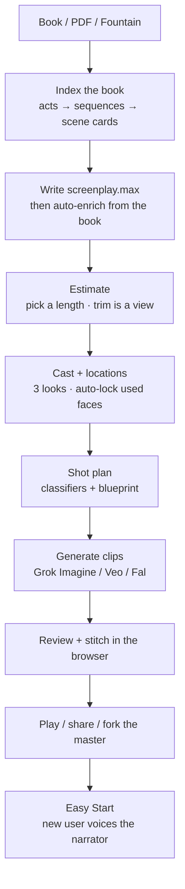

# PageToMovie (Film Studio)

Turn a book or screenplay into a film: **Book → Estimate → Film**.

Pick a story, get a full screenplay (the **max master**), then cut it to 120 minutes or keep every chapter. Forkable titles share that master — the next person trims or films; they do not adapt Homer again.

**One process.** The API hosts the UI. You do not run a separate Blazor site.

## What you do

| Path | Who | Flow |
|------|-----|------|
| **[Easy Start](#easy-start)** | First-time / voice | Pick a public story → record one sample → hear the narrator as you |
| **Full studio** | Making a film | Import book or Fountain → Estimate (length + $) → Cast & locations → Film → Review |

Estimate is two numbers: **what it will cost** and **what you’ve spent**. Fit length cuts the outline; it does not re-adapt.

Guards and phases (Book / Estimate / Film / Review) are in the **[studio state machine](docs/studio-decision-flow.md#4-state-machine)**.

## Easy Start

**Route:** `/simple-voice` — “Two steps · story and your voice.”

You do **not** write a screenplay. You pick a library title that someone already filmed and put **Public (Forkable)** on. Pictures stay as they are; only the narrator speaks as you.

1. **Choose a story** — public catalog (no login to browse). Each card is a forkable film; if it has a max master you inherit the full screenplay.
2. **Sign in** if you have not — pick still requires an account.
3. **We fork a private copy** for you (video stays on the source; you re-voice).
4. **Record one sample** (or pick which speaking character if there is no obvious narrator).
5. **Make movie** — we clone that voice onto the narrator lines and you play the result.

Mark a finished film **Public (Forkable)** in the full studio so it appears here. Easy Start never re-adapts the book.

## Run

Needs:

- .NET SDK (solution is `net10.0`)
- `XAI_API_KEY` for real Grok chat / image / video (optional fakes for UI soaks)
- Chrome or Edge for stitch, silence trim, and review frames (**ffmpeg.wasm** in the browser — the server never installs ffmpeg)

```powershell
cd host
$env:XAI_API_KEY = "your-key"          # skip if using fakes
$env:PageToMovie__UseFakes = "false"   # "true" = no xAI spend
dotnet run --project PageToMovie.Api
```

Open **http://127.0.0.1:5088**. Health: `GET /health`. Easy Start: **http://127.0.0.1:5088/simple-voice**.

Visual Studio: open `host/PageToMovie.slnx` and start **PageToMovie.Api** only.

`PageToMovie.Web` is the WASM client **published inside the API**. Run it alone only if you are splitting ports on purpose (`EngineApi:BaseUrl` → the API).

Workspace root (`PageToMovie:WorkspaceRoot`) empty → the API uses the repo root. Projects live under `projects/<owner>/<slug>/`.

## Pipeline (short)



1. **Ingest** — text, PDF (vision OCR for picture books), or an existing Fountain.
2. **Max master** — plan a beat sheet, write the full Fountain, then **enrich automatically** (visual detail from the book; dialogue and scene count stay). Short books: one pass. Novels: index, then write sequences. Default planning model: **Grok 4.6**.
3. **Estimate** — set target minutes or keep every sequence. Snapshot first; Undo prune restores.
4. **Cast & places** — extract used faces/locations, generate three looks, auto-lock the best. Voice clone or stock TTS.
5. **Shot plan** — book-wide + per-scene classifiers → clip blueprint. Authoritative call list: [`docs/architecture/MODEL_CALL_INVENTORY.md`](docs/architecture/MODEL_CALL_INVENTORY.md).
6. **Film** — catalog-routed video (Grok Imagine, Veo, Fal) with locked plates.
7. **Review / export** — advisory vision review; stitch and play in the browser.
8. **Share** — mark Public (Forkable). The next person uses Easy Start or forks into Estimate.

Look (re-skin the medium) is optional. Fit length only writes the working `screenplay.fountain`. Enrich is part of write, not a button.

## Layout

| Path | Role |
|------|------|
| `host/PageToMovie.Api` | **Start this** — REST, SignalR, hosted UI |
| `host/PageToMovie.Web` | Blazor WASM (same origin as the API) |
| `host/PageToMovie.Engine` | Jobs, store, video, files |
| `host/PageToMovie.Adaptation` | Stage‑1: index, write, trim, enrich |
| `projects/` | Per-film fountain, max, index, cast, clips, WIP |
| `prompts/` | Product prompts |
| `docs/` | [Documentation map](docs/README.md) and [state machine](docs/studio-decision-flow.md#4-state-machine) |
| `docs/max-master-adaptation-plan.md` | Full screenplay, cut later |

## Tests

```powershell
cd host
dotnet test PageToMovie.Tests          # default — no paid API calls

# Paid LiveApi tests are opt-in only
$env:PAGETOMOVIE_LIVE_API_TESTS = "1"
$env:XAI_API_KEY = "xai-..."
dotnet test PageToMovie.Tests --filter "Category=LiveApi"
```

Playwright pilot (against a running API): `host/playwright/README.md`.

## Docs

**Map (top-down):** [`docs/README.md`](docs/README.md)

| Doc | Topic |
|-----|--------|
| [**Documentation map**](docs/README.md) | Product story + links + what to archive |
| [**State machine**](docs/studio-decision-flow.md#4-state-machine) | Phases, guards, Generate vs Edit |
| [`docs/studio-decision-flow.md`](docs/studio-decision-flow.md) | Book → Estimate → Film (full plan) |
| [`docs/max-master-adaptation-plan.md`](docs/max-master-adaptation-plan.md) | Index, write, auto-enrich, trim, share |
| [`docs/architecture/MODEL_CALL_INVENTORY.md`](docs/architecture/MODEL_CALL_INVENTORY.md) | Every model call |
| [`docs/supported-models.md`](docs/supported-models.md) | Catalog / how models are chosen |
| [`docs/voice-substitution-design.md`](docs/voice-substitution-design.md) | Easy Start / “speak as you” |
| [`docs/media-timeline-contract.md`](docs/media-timeline-contract.md) | Valid video/audio, black intros, and frozen-frame outros |
| [`docs/public-community-plan.md`](docs/public-community-plan.md) | Public (Forkable) library |
| [`host/README.md`](host/README.md) | API routes, SignalR, YouTube, LoadSim |
| [`AGENTS.md`](AGENTS.md) | North star for contributors |

## Config

- Workspace: `PageToMovie:WorkspaceRoot` (empty = repo root).
- Fakes: `PageToMovie:UseFakes` / `PageToMovie_USE_FAKES=true`.
- Models: `host/PageToMovie.Core/config/models_catalog.json` is the only list of providers and models.
- Auth: `PageToMovie:Auth` in Api `appsettings`.
