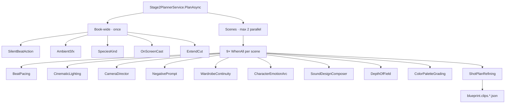

# Model-call inventory

Status: verified operation inventory. `MODEL_LIFECYCLE_MIGRATION_CHECKLIST.md` remains the authoritative completion checklist. A row marked **Lifecycle** means the feature request is owned by an `IModelOperation` or `ValidatedCoverageOperation`; **Direct** identifies remaining migration work; **Transport** is provider/routing infrastructure rather than a feature operation; **Orchestrator** delegates and does not parse a raw model response.

## Enforced boundaries

| Namespace | Owner | Responsibility | Model access |
|---|---|---|---|
| `PageToMovie.Engine.Deterministic` | Engine architecture | Parsing, normalization, estimation, heuristic fallback | Forbidden, including HTTP and `ModelExecution` dependencies |
| `PageToMovie.Engine.ModelBacked` | Feature operation owner | Prompts, requests, response adapters | Through `ModelExecution` |
| `PageToMovie.Engine.ModelExecution` | Lifecycle infrastructure | Retry, correction, validation, provenance | Transport orchestration only |

The boundary is enforced by reflection plus source-contract tests. This is the repository's compile/test-time equivalent of a separate deterministic assembly; an assembly split is optional hardening, not an untracked prerequisite.

## Client and transport surfaces

| File/interface | Owner | Operation | Version | Status |
|---|---|---|---|---|
| `IChatClient`, `IVisionClient`, `IGeminiVideoAnalysisClient` | Engine abstractions | Text/vision analysis transport contracts | Interface contract | Transport |
| `IVideoClient`, `IImageClient`, `IAudioClient`, `ILipSyncClient`, `IVoiceCloneClient` | Engine abstractions | Media generation transport contracts | Interface contract | Transport |
| `AnthropicChatClient`, `GeminiChatClient`, `GrokChatClient`, `GrokVisionClient`, `FalVoiceCloneClient` | Provider adapters | Provider request/response transport | Provider API | Transport |
| `MultiProviderChatClient`, `MultiProviderVisionClient` | Provider routing | Catalog-resolved provider selection | Catalog schema | Transport |
| `CachingChatClient` | Model transport cache | Raw response cache | Cache key v1 | Transport |
| `AiRetryPolicy` | Model execution | Transient retry and coverage primitive | v1 | Lifecycle infrastructure |
| `GenerationErrorLogger` | Operations telemetry | Failure recording | generation-errors.v5 | Lifecycle consumer |

## Adaptation and planning operations

| File | Owner | Operation name | Prompt/schema version | Status |
|---|---|---|---|---|
| `Stage1FountainOperation` / `BookToFountainConverter` | Stage 1 | `stage1_fountain_adaptation` | prompt hash + Fountain/VISION_META contract | Lifecycle |
| `ProjectVisionMeta` | Stage 1 metadata | `vision_meta_repair` | VISION_META v1 | Direct — repair call remains |
| `CastFromScreenplayService` / `CastModelOperations` | Cast | `cast_extraction` | prompt 1 / cast_seeds.v1 | Lifecycle |
| `CastVisualLiteralizeService` / `CastModelOperations` | Cast | `cast_visual_literalize` | prompt 1 / closed key set | Lifecycle |
| `Stage2PlannerService` | Stage 2 aggregate | `stage2_shot_plan` | stage2_meta contract | Orchestrator |
| `AiActionOverheadClassifier` | Stage 2 timing | `action_overhead_classifier` | 1 | Lifecycle |
| `AmbientSfxClassifier` | Stage 2 audio | `ambient_sfx` | classifier prompt constant / requested-ID map | Lifecycle coverage |
| `BeatPacingClassifier` | Stage 2 pacing | `beat_pacing` | classifier prompt constant / requested-ID map | Lifecycle coverage |
| `CameraDirectorClassifier` | Stage 2 camera | `camera_director` | classifier prompt constant / requested-ID map | Lifecycle coverage |
| `CharacterEmotionArcClassifier` | Stage 2 emotion | `character_emotion_arc` | classifier prompt constant / requested-ID map | Lifecycle coverage |
| `CinematicLightingClassifier` | Stage 2 lighting | `cinematic_lighting` | v1_product / lighting_token | Lifecycle |
| `ColorPaletteGradingClassifier` | Stage 2 grading | `color_palette_grading` | v1_product / color directive | Lifecycle |
| `DepthOfFieldClassifier` | Stage 2 camera | `depth_of_field` | classifier prompt constant / requested-ID map | Lifecycle coverage |
| `ExtendCutClassifier` | Stage 2 continuity | `extend_cut` | classifier prompt constant / clip map | Lifecycle coverage |
| `NegativePromptClassifier` | Stage 2 visual guard | `negative_prompt` | v1_product / negative_tokens | Lifecycle |
| `OnScreenCastClassifier` | Stage 2 cast | `on_screen_cast` | classifier prompt constant / requested-ID map | Lifecycle coverage |
| `PlateRankClassifier` | Cast references | `plate_rank` | v1 / ranked candidates | Direct — outside core adaptation migration |
| `ShotPlanRefiningClassifier` | Stage 2 refinement | `shot_plan_refining` | classifier prompt constant / immutable plan fields | Lifecycle coverage |
| `SilentBeatActionClassifier` | Stage 2 action | `silent_beat_action` | classifier prompt constant / requested-ID map | Lifecycle coverage |
| `SoundDesignComposerClassifier` | Stage 2 sound | `sound_design_composer` | classifier prompt constant / requested-ID map | Lifecycle coverage |
| `SpeciesKindClassifier` | Cast/Stage 2 | `species_kind` | classifier prompt constant / closed taxonomy | Lifecycle coverage |
| `WardrobeContinuityClassifier` | Stage 2 wardrobe | `wardrobe_continuity` | classifier prompt constant / requested-ID map | Lifecycle coverage |
| `LookVariantPicker` | Cast / location looks | `look_variant_pick` | best-of-N index JSON | Direct vision — plan_looks auto-lock |
| `SceneMusicScoringService` | Stage 2 music | music suitability and prompt analysis | local prompt / JSON | Direct |
| `LearningProposalService` | Learning | learning proposal | local prompt / proposal JSON | Direct, advisory |
| `FilmJobService` | Pipeline orchestration | stage execution | delegated versions | Orchestrator |

### Stage 2 topology (runtime)

Notes:
- Peak chat ≈ **2 scenes × 9 classifiers** until backlog **J1** (shared chat semaphore 4–8).
- Depth-of-field + color grading are first-class per-scene peers of lighting/camera (not post-only).
- `AiActionOverheadClassifier` is on the timing path, not inside the per-scene WhenAll suite.

## Vision, multimodal, and media operations

| File | Owner | Operation name | Prompt/schema version | Status |
|---|---|---|---|---|
| `BookPrepareService` | Import | page transcription | vision contract | Direct |
| `CharacterBookPlateService` | Cast references | character page classification | vision contract | Direct |
| `CharacterDesignService` | Character design | image identity analysis | vision contract | Direct |
| `ClipAutoReviewService` | Clip review | `clip_auto_review` | review prompt/schema v1 | Lifecycle |
| `ClipDialogueVerificationService` | Dialogue review | `clip_dialogue_verification` | transcription comparison v1 | Lifecycle |
| `MovieAutoReviewService` | Movie review | `movie_auto_review` | observation/judgment v1 | Lifecycle |
| `JitBenchmarkService` | Evaluation | optional vision judge | rubric version | Direct, benchmark only |
| `SceneMusicCompositionService` | Music | scene composition analysis | composition contract | Direct |
| `FilmJobService` voice/media calls | Media orchestration | generation, voice, lip-sync | catalog model + request parameters | Orchestrator; binary provenance remains operation-specific |

## Verified follow-on work outside this migration

- Direct calls remain in `ProjectVisionMeta`, `SceneMusicScoringService`, and `LearningProposalService`; these auxiliary metadata, music, and advisory operations are not part of the Stage 1 package, cast extraction, Stage 2 planner/classifier, or multimodal-review migration closed here.
- Direct vision operations remain in import, character-reference/design, benchmark judging, and scene-music composition paths.
- Provider transports and routing deliberately call client interfaces and are not feature-lifecycle bypasses.
- Media generation needs the same provider/model, parameter, attempt, artifact-hash, and terminal-status envelope; binary validation remains feature-specific.

## Completion record

- [x] Namespace conventions and deterministic dependency rule are enforced.
- [x] Chat, vision, media, provider, routing, and orchestration surfaces are inventoried with owner, operation, version, and status.
- [x] Stage 1, cast, Stage 2 target classifiers, and multimodal review operations are represented by shared lifecycle owners.
- [x] Stale phase-baseline and obsolete recovery descriptions were removed.
- [x] Deterministic code has an equivalent compile/test-time architecture boundary.
- [x] Every row has an explicit lifecycle, direct, transport, or orchestrator status; direct follow-on work is not represented as migrated.
- [x] Core adaptation scope (Stage 1 package, cast extraction, Stage 2 planner/classifiers, and multimodal review) has no unowned direct model request.

Media generation and auxiliary direct operations remain a separately inventoried follow-on. Closing this lifecycle migration does not relabel those operations or claim that their feature-specific binary provenance work is complete.
