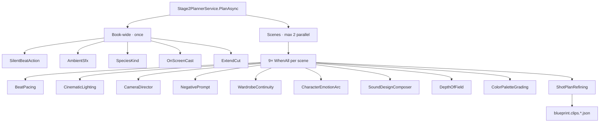

| `WardrobeContinuityClassifier` | Stage 2 wardrobe | `wardrobe_continuity` | classifier prompt constant / requested-ID map | Lifecycle coverage |
| `LookVariantPicker` | Cast / location looks | `look_variant_pick` | best-of-N index JSON | Direct vision (`CompleteWithImagesAsync`) — plan_looks auto-lock |
| `SceneMusicScoringService` | Stage 2 music | music suitability and prompt analysis | local prompt / JSON | Direct |
| `LearningProposalService` | Learning | learning proposal | local prompt / proposal JSON | Direct, advisory |
| `FilmJobService` | Pipeline orchestration | stage execution | delegated versions | Orchestrator |

### Stage 2 topology (runtime)

Notes:
- Peak chat ≈ **2 scenes × 9 classifiers** until backlog **J1** (shared chat semaphore 4–8).
- Depth-of-field + color grading are first-class per-scene peers of lighting/camera (not post-only).
- `AiActionOverheadClassifier` (table above) runs on the timing path, not inside the per-scene WhenAll suite.

## Vision, multimodal, and media operations
