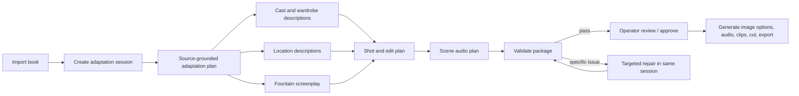

# Verified Adaptation Session Pipeline

## Purpose

Turn a book into a reviewable movie package with minimal manual work, while keeping spending bounded and every creative artifact traceable to its source. The system creates descriptions and plans first. Image, audio, and video generation happen only after those descriptions pass their respective gates.

## End-to-end path



## Session and source records

`source/adaptation_session.json` identifies the source fingerprint, selected provider/model settings, stateful conversation identifier, cost budget, and retry limits. It is the parent record for every downstream artifact.

`source/adaptation_plan.json` preserves the source-grounded timeline, premise, essential beats, withheld-name/twist rules, and the scene outline. Every consequential claim has short source evidence.

Each artifact has a schema version, source fingerprint, producing prompt revision, provider/model, effective sampling settings, timestamp, and a validation result. A repair adds an attempt record; it does not overwrite the prior candidate.

## Sidecars and their contracts

| Artifact | What it establishes | Objective checks |
|---|---|---|
| `cast_seeds.json` | Stable character keys, physical descriptions, age variants, wardrobe variants, voice profiles, render-style lock | Every cast/wardrobe reference resolves; no accidental name reveal |
| `location_bible.json` | Canonical locations, layout anchors, lighting states, persistent props, reference-image briefs | Every scene maps to one canonical location; all referenced locations exist |
| `screenplay.fountain` | Adapted narrative and dialogue only | Fountain parse/syntax, scene headings, source rules, no metadata leakage |
| `edit_decision_list.json` | Per-scene location, cast-age/wardrobe variants, visual beats, duration | All sidecar references resolve; duration/scene limits |
| `audio_plan.json` | Per-scene score intent, timing, diegetic sound, intentional silence, exclusions | Exactly one coverage record for each EDL scene; no orphan scenes |
| `delivery_manifest.json` | Aspect, resolution, captions, credits, review requirements | Required delivery values are defined or explicitly marked operator choice |

All visual descriptions are text at this stage. Only after approval does the product request character or location image options. The user can compare alternatives, lock one, or regenerate one without invalidating the screenplay.

## Gates: code first, judgment second

Every stage follows the same bounded loop:

1. Generate one candidate into a versioned attempt folder.
2. Run deterministic validators: JSON schema/type checks, cross-file references, Fountain parsing, source fingerprint, coverage, duration, budget and content-safety checks.
3. If objective checks pass, run an independent LLM judge on a compact review packet. The judge receives the source excerpts, artifact, rubric, and any prior validation diagnostics—not vague “make it better” instructions.
4. The judge returns structured findings with severity, evidence, affected IDs, and a precise repair instruction. It cannot itself replace the asset.
5. For blocking findings only, submit a targeted repair request in the same adaptation session. The repair is restricted to listed fields/scenes and must preserve all other approved fields.
6. Re-run both gates. Stop at success, a small attempt cap, a cost cap, or an escalation-worthy disagreement. Preserve all attempts for A/B comparison.

The judge has no candidate self-score. Use two inexpensive, independent providers for blocking creative review, with a stronger third judge only to resolve material disagreement. Deterministic failures never spend on an LLM judge or repair.

## Example: missing score for scene S07

The EDL contains `S07`, but `audio_plan.scenes` does not. The local validator emits:

```json
{
  "code": "AUDIO_SCENE_MISSING",
  "scene_id": "S07",
  "message": "audio_plan is missing scene S07."
}
```

The repair call receives the source evidence and the existing plan, with the narrow instruction: *Return only the `S07` audio record. Include score intent, timing, diegetic sound, silence guidance, exclusions, and source evidence. Do not change any other scene.* The repaired record is merged only after it validates. If it still fails, the system stops after the configured repair cap and asks for review rather than repeatedly spending.

## Stateful calls without pretending they are free

For long books, retain the book and approved planning artifacts in a provider-side adaptation session rather than re-sending them for every repair. The client needs a provider-neutral session interface, implemented by adapters (for example, a stateful responses-session adapter where the provider supports it). Store the provider conversation ID in `adaptation_session.json`; never treat the raw ID as product data.

Stateful context reduces repeated input, but it still consumes tokens and is subject to retention, context-window, privacy, and compaction limits. Every repair packet should include the exact artifact version plus the relevant source excerpts, so validation remains reproducible even after compaction.

### Non-negotiable book-context rule

**A complete book is uploaded or sent to a provider at most once per adaptation session.**

`source/adaptation_session.json` must persist the provider, model, source fingerprint, uploaded
file ID, latest response ID, upload time, expiry time, and artifact revision pointers. The
recommended initial retention window is 30 days. A later call sends only its new instruction and
the small approved artifact it needs, using the stored IDs. It must never silently fall back to
putting the complete book into a new prompt. If the provider file or session has expired, the
product stops, explains that the saved context expired, and asks the operator before starting a
new paid upload/session.

The current product chat implementation is still stateless. This policy is therefore a required
product implementation item, not a claim about the existing production behavior.

## Media stages after planning approval

- **Character and location images:** generate described options; use visual evaluation for identity, period, wardrobe, layout, and style consistency; save an approved reference lock.
- **Music and sound:** generate/download one take at a time; validate duration, format, scene mapping, silence/exclusion constraints, then allow A/B take comparison and removal.
- **Video clips:** validate duration, cast/location locks, continuity, caption safety, and visual defects; retry only failed clips.
- **Editorial cut and delivery:** verify clip coverage, no duplicate media, audio sync/mix, captions, credits, target aspect/resolution, and export manifest.

## Benchmark prototype: status and lessons (2026-08-01)

The planning pilot and its validator live only under `host/tools/ScreenplayBenchmark` and
`evals/sidecar_pilots`. They do not change the current PageToMovie operator workflow.

Four planning packages were generated and passed local cross-file validation after the validator
was generalized for legitimate keyed/list representations: Nick and Me, The Tell-Tale Heart, A
Christmas Carol, and The Velveteen Rabbit. The pilot proved that source-grounded cast, location,
audio, and edit sidecars can be formed and checked without generating media.

It also exposed a decisive design problem: asking one response for every sidecar *and* a Fountain
screenplay, while asking for a concise short-film package, produces a treatment-like screenplay.
For example, the Nick and Me pilot has 9 EDL records / 10 Fountain headings, while the existing
Grok 4.5 benchmark Fountain has 32 headings. The Tell-Tale Heart pilot has 5 EDL records / 7
Fountain headings, while existing benchmark drafts range much higher. Local cross-file validation
alone cannot judge dramatic coverage.

The dedicated `prompts/book_to_fountain.txt` prompt already contains the stronger Fountain rules:
runtime target, full narrative arc, valid formatting, concrete locations, source-grounded spoken
dialogue, controlled V.O., character continuity, and sound cues. It must remain a separate
screenplay stage. The EDL, cast, location, and audio sidecars follow an approved Fountain; they
must never compete with it as a shorter summary.

For Nick and Me, the product target is a **90-minute feature**, not a short film. The feature
Fountain stage must receive a target feature runtime and be judged for dramatic coverage,
dialogue coverage, and estimated length before any sidecars or media are generated.

## Work remaining before another paid feature attempt

1. Implement the production stateful adaptation-session client: upload the book once, save the
   file/response IDs in `source/adaptation_session.json`, and use follow-up requests for all work
   during the 30-day session window.
2. Do not use the current stateless pilot or `chat/completions` path for a new full-book feature
   attempt.
3. Add a feature-Fountain stage that uses the dedicated Book-to-Fountain prompt with an explicit
   runtime/format target (Nick and Me: 90 minutes), rather than requesting all sidecars in one call.
4. Add screenplay quality gates beyond parseability:
   - required target-runtime / scene-density range;
   - beat-to-scene coverage and feature arc completion;
   - real source-grounded dialogue where the book contains speech;
   - V.O. as support rather than an all-summary substitute;
   - Fountain-heading to EDL one-to-one reconciliation.
5. Add independent LLM judges after deterministic gates pass. Judges use the saved book session,
   approved Fountain, source excerpts, and structured rubrics; they return narrow repair findings.
6. Only after the Fountain is approved, derive cast/wardrobe, locations, EDL, audio plan, then
   image/audio/video work. Media generation remains out of scope until the planning path is proven.
