# Public library, forks, and invite

**Status:** most of the table below is **built** (invite, visibility, fork, Git merge, upvotes). Remaining rows are follow-ups, not a greenfield plan.

Forkable titles appear in Easy Start. Namespaced project remotes: [archive/github-projects-backup-checklist.md](archive/github-projects-backup-checklist.md).

**Priority Note**: Collaboration is unified under the **Invite-to-Fork & Async Diff-Merge Model** powered by client-side media storage, Git-backed server engine (`LibGit2Sharp`), and privacy-preserving user invites.

---

## Feature list

> **Status audit (2026-07-26):** a wave of `feat(phaseN): Implement X` commits landed claiming most of this
> roadmap was built. Verification against the running app found most of them create a plausible-looking file
> (service class or Razor component) with a passing unit test, but never wire it into the running app (no DI
> registration, no API route, no page inclusion) — and one (`ProjectGitRepositoryService`) is a hardcoded fake
> with no real Git operations at all. The table below reflects verified reality, not commit messages. See
> `host/docs/issues/` for anything that needs a real fix before being trusted.

| # | Feature | Status | Notes |
|---|---------|--------|--------|
| 1 | **Invite-to-Fork Collaboration** | **done** | Real, persisted, single-use 48h invite tokens (`ProjectInviteService`, own SQLite table, SHA-256 hashed — token never stored in plaintext) emailed via the existing `IEmailSender`. `POST /api/projects/{id}/invites` (owner/admin gated) → `/join?token=…` (new `Join.razor` page) → `POST /api/invites/accept` → `ProjectStore.ForkProjectAsync`. `ProjectCollaboratorsModal.razor` fixed (it previously reported "Invitation sent!" even on HTTP errors/exceptions, and its Close button didn't propagate to the parent) and wired into `Home.razor` as a "Collaborate" button on the active project. Tests: `ProjectInviteServiceTests`, `InviteToForkApiTests` (full create→invite→accept→verify-fork round trip + ownership gating), plus `ProjectForkTests` below. |
| 2 | **Demo ratings (upvotes only)** | **done** | ★ on `/demo`; sort top/new. `DemoUpvoteService` registered in DI and wired to `/api/demos/*/upvote` + `?sort=`. Verified. |
| 3 | **Repository Visibility Modes** | **done** | Standard Git modes: 🔒 **Private**, 👁️ **Public (Read-Only)**, 🍴 **Public (Forkable)** (`Open`). `ProjectInfo.VisibilityMode` stored in `project.json` and cached via `ProjectReadCache.cs`. `POST /api/projects/{id}/visibility` API endpoint mapped. `ForkProjectAsync` enforces permission (non-owners can only fork if mode is `Open`). Studio UI dropdown selector in `Home.razor` plus 1-click **🍴 Fork** button on `/demo` gallery cards. Tests: `ProjectVisibilityModeTests`. |
| 4 | Content hash of exportable package | **done** (correction) | Earlier audit pass missed this: `MediaRegistryService.IsTrustedShaAsync` + `/api/demos` POST already auto-approves a demo upload whose SHA-256 matches the project's own trusted gen/export registry, bypassing the admin queue. Predates this pass. |
| 5 | **Fork** (plan-only package v1) | **done** | `ProjectStore.ForkProjectAsync` copies screenplay/cast/blueprint/rules/character-reference text and images into a new project directory under the new owner, excluding `.mp4/.webm/.mov/.wav/.avi` and any `.git` history — never touches the process-global active-project pointer (forking on someone's behalf must not steal another user's active project). Tests: `ProjectForkTests`. |
| 6 | **Fork banner + “forked from” metadata** | **done** | `ProjectInfo.ParentProjectId` is populated on every fork. `Home.razor` renders a `🍴 Fork of {ParentProjectId}` badge in the project list and a `🔄 Sync Origin` button for forked projects. `AdaptationShell.razor` renders a `🍴 Fork of {ParentProjectId}` badge in the adaptation header. Verified. |
| 7 | **Contribution & Git 3-Way Merge** | **done** | `ProjectGitRepositoryService` is now real: `LibGit2Sharp`-backed `Repository.Init`/stage/commit, and `SyncForkFromOriginAsync` does a genuine fetch + 3-way merge (real conflict detection, never auto-resolves). Reachable via `POST /api/projects/{id}/commit` and `/sync-origin` (owner/admin gated). Tests: `ProjectGitRepositoryServiceTests`. |
| 8 | **Contribution accept / reject + conflict review** | **done** | `ContributionReview.razor` page (`/projects/{id}/review-contribution`) displays structured line-by-line diffs across screenplay, cast seeds, shot plan, and rules. Integrated `Accept & Sync Merge` and `Reject / Cancel` actions with `ProjectContributionService.cs` and `GET /api/projects/{id}/contribution-diff`. `Home.razor` renders a `🔍 Review Diff` button for forked projects. Tests: `ProjectContributionServiceTests`. |
| 9 | **Sync Fork from Origin** | **done** | See #7 — `SyncForkFromOriginAsync` performs a real merge via `POST /api/projects/{id}/sync-origin`. |
| 10 | **Media-Aware Contribution PRs** | **done** | Transfers shot plan diffs + SHA-256 hashes (< 1 KB). Downloads via direct AI provider CDN URL (< 24h) or automated fallback to transient server proxy (> 24h), guaranteeing zero clip loss with cryptographic SHA-256 hash verification. Integrated into `ProjectContributionService.cs`, `POST /api/projects/{id}/contribution-sync-media`, and `ContributionReview.razor` (**🎬 Media Clips & Provenance** tab). Tests: `MediaAwareContributionTests`. |
| 11 | **Direct Gallery "Fork Project" Button** | **done** | 🍴 **Fork project** on public `/demo` cards when the film’s studio project still exists (`canFork`). `POST /api/demos/{id}/fork` (sign-in + terms) calls `ProjectStore.ForkProjectAsync` — lightweight package, no video. Anonymous users are sent to login. Visibility modes (#3) not required yet: any public demo with a live `projectId` is forkable. Tests: `DemoGalleryForkApiTests`. |
| 12 | ~~Project ratings~~ | **obsolete** | Superseded by Demo Upvotes on `/demo` gallery cards (Item #2). Upvoting a movie rates the project directly. |
| 13 | **YouTube Direct Comment Link** | **done** | `💬 Comment on YouTube ↗` button on `/demo` gallery cards, shown once a demo has a `YoutubeUrl`. |
| 14 | **Creator Profile Badges & Stats** | **done** | `CreatorProfileService.cs` computes movies published, total upvotes, and forks spawned dynamically from SQLite `demos` and `projects`. `GET /api/creators/{handle}` endpoint. Reusable `CreatorProfileHeader.razor` component with badges (🌟 Debut Director, 🎬 Featured Filmmaker, 🍴 Open Source Pioneer) and `/creator/{handle}` page (`CreatorProfile.razor`). Gallery card handles link to profile pages. Tests: `CreatorProfileServiceTests`. |
| 15 | Admin cross-user project export/import | **done** | `POST /api/admin/projects/import` (admin-gated) accepts `targetUserId` and threads it into `ProjectArchiveService.ImportAsync`. Verified. |
| 16 | Server media pruner (48h TTL) | **done** | Fixed: `ServerMediaPruningService` now resolves its root via `ProjectStore.WorkspaceRoot` (matches the rest of the app), only ever deletes a file `MediaRegistryService` has confirmed the client already synced, and defaults **off** (`PageToMovie:MediaPruning:Enabled`, opt-in per deployment). Tests: `ServerMediaPruningServiceTests`. |
| 17 | Terms of Service acceptance gate | **done** | `AuthGate.RequireTermsAcceptedAsync` (composes with `RequireLogin`, bypassed for admin and when `Auth:RequireLogin=false` for tests/LoadSim) now gates `POST /api/projects`, `/api/jobs/gen-scene`, `/api/jobs/gen-batch`, `/api/jobs/stage1`, `/api/jobs/stage2`, and `POST /api/demos` (publish). The four job-start endpoints had no auth context at all before this pass (see `host/docs/issues/issue-09-spoofable-user-spend-gates.md`) — adding the terms gate also closed that login gap for them. Tests: `AuthGateTests`. |
| 18 | YouTube auto-upload + publish modal | **done** | Redesigned rather than wired as-is: the old `YouTubeUploadService.cs` reinvented OAuth with its own unconfigured env vars, duplicating the already-working `YouTubeAuthService` (used by Review's WIP-movie upload) — deleted in favor of `DemoYouTubePublisherService`, which reuses `YouTubeAuthService`'s real Google API client. Demos now migrate to YouTube automatically: on SHA-trust auto-approval or admin approval, upload runs in the background (fire-and-forget `Task.Run`, not yet a trackable job — see notes), then the local `movie.mp4` is deleted and the entry is repointed at `YoutubeId`/`YoutubeUrl`. `/demo` renders a `youtube-nocookie.com` embed once present, falling back to direct server streaming if upload hasn't happened yet or fails (video never deleted on failure). `PublishDemoModal.razor` (never wired, duplicated Review's own working save-dialog) was deleted; the real save-dialog in `Review.razor` was extended with the COPPA made-for-kids radio and AI-disclosure checkbox instead. Tests: `DemoCatalogServiceTests`, `DemoYouTubePublisherServiceTests`. |
| 19 | Clip prompt/version compare viewer | **done** | This needed more than wiring — there was no clip-version history mechanism in the app at all (each regen overwrote its `.meta.json`/video in place). Added: server-side prompt-version archiving (`FilmJobService.ArchiveClipPromptHistory`/`ListClipPromptHistory`, `assets/video/history/*.meta.json`) triggered whenever a clip's prompt meta is about to be overwritten; client-side video archiving (`pagetomovie-media.js._archiveClipHistoryAsync`, `assets/video/history/*.mp4`) triggered whenever `saveFromUrlAsync` is about to overwrite an existing clip file. New endpoint `GET .../clips/{clip}/prompt-history`. `Scenes.razor`'s clip detail panel shows a "Compare with previous version" toggle backed by real archived data (prompt dropdown + most-recently-archived video — the two are archived independently by different processes, so they're paired by recency rather than an exact per-edit match). Tests: `ClipPromptHistoryTests`. |

---

## Roles (lifecycle, not account types)

| Role | Meaning |
|------|---------|
| **Anon** | Browse **public** / **open** demos in gallery; play if streamable; no fork, no upvote. |
| **Signed-in** | Same + **upvote** demos; **fork** only when mode is **open**; may be **invited** as project member. |
| **Project owner** | `ownerUserId`; invite/remove members; visibility/public/open; delete project; publish demo (as today). |
| **Project editor** (collaborator) | Member of **same** project; edit/gen/review per policy; **not** owner admin actions. |
| **Fork owner / community contributor** | Same user **after** **fork** of an **open** project; edit copy; submit contribution (later). |
| **Upstream owner** | Accept/reject community contributions (later). |

“Collaborator” = invited to the **same** project.  
“Community contributor” = forked **open** project and optional PR — different path.

---

## Project Collaborators & Invite-to-Fork Collaboration Architecture

### Intent
Collaboration in PageToMovie is unified under the **Invite-to-Fork & Async Diff-Merge Model** powered by client-side media storage and Git 3-way merging (`LibGit2Sharp`). 

Instead of forcing collaborators to edit live files simultaneously on a shared server directory (which causes file locks, overwrite races, and high server storage load), collaborators receive a private invite to spawn an independent, lightweight fork (< 5 MB package containing Fountain screenplay, cast seeds, Stage 2 shot plan blueprint, and rules).

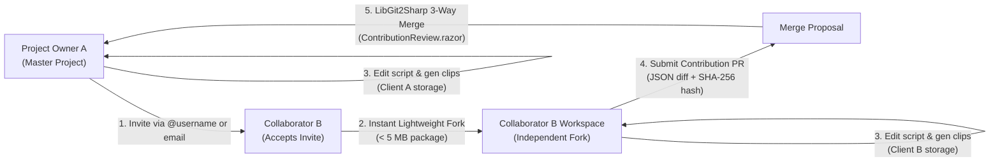

### Key Architectural Standards:
1. **Invite-to-Fork**: Project owners invite collaborators via public handle (`@username`) or blind email.
2. **Lightweight Workspace (< 5 MB)**: Collaborators get an instant fork containing text, screenplay Fountain scripts, character seeds, shot plan blueprints, and rules.
3. **Client-Side Media Storage**: Collaborators store generated MP4 clips locally on their own PC hard drives (`assets/video/`), keeping Railway server disk usage **< 100 MB**.
4. **Git 3-Way Merging (`LibGit2Sharp`)**: Merging screenplay beats or blueprint fields uses Git's battle-tested 3-way merge algorithm (`ours`, `theirs`, `base`) with visual diff review (`ContributionReview.razor`).

---

## Project Namespacing & User Slug Architecture

### Intent
Prevent folder overwrites, database key collisions, and URL conflicts when multiple users create projects with identical display titles (e.g., User `@alice` and User `@bob` both creating a project named `Buster`).

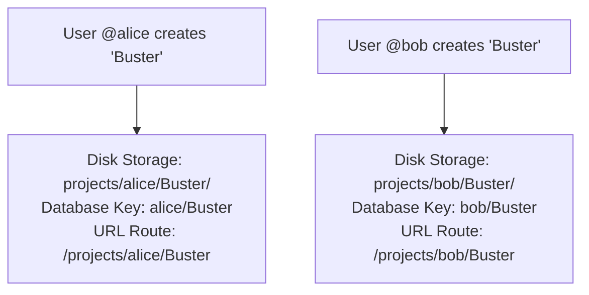

### Key Technical Standards:
1. **Per-User Directory Scoping**: Project folders on server disk and local client storage are nested under the owner's handle/ID (`projects/{username}/{projectSlug}/`).
2. **Composite Primary Keys**: Database queries identify projects by composite key `(owner_user_id, project_slug)` or route string `alice/Buster`.
3. **Clean URL Routing**: Public project pages and fork endpoints use human-readable routes (`/projects/@alice/Buster`).
4. **Display Title vs. Folder Slug**: Display title can be changed freely by the owner (e.g. *"The Buster Movie (Cut 1)"*) without affecting the immutable storage slug.

---

## Repository Visibility Modes (Standard Git Terminology)

Project owners select a Git-aligned visibility level controlling public access and community forking rights:

| Git Visibility Mode | Public Play (YouTube Stream) | Community Forking (Studio Blueprint & Script Package) | Access Control |
| :--- | :--- | :--- | :--- |
| 🔒 **Private Repository** | No | No | Owner & invited collaborators (`@username` / email) only |
| 👁️ **Public Repository (Read-Only)** | Yes | No | Listed in public gallery; watch-only; **Forking Disabled** |
| 🍴 **Public Repository (Forkable)** | Yes | Yes | Listed in public gallery; **Open Community Forking & Pull-Requests Enabled** |

### Direct `/demo` Gallery "Fork Project" Integration

Rather than requiring a separate navigation page, the **🍴 Fork Project** action is integrated directly into the existing `/demo` gallery cards and movie detail modals:

```text
┌───────────────────────────────────────────────────────────────────────────┐
│  The Tell-Tale Heart                                                      │
│  By @edgar_allan_poe  •  Public Repo (Forkable)                           │
├───────────────────────────────────────────────────────────────────────────┤
│  [ YouTube Embedded Player ]                                              │
├───────────────────────────────────────────────────────────────────────────┤
│  👍 42 Upvotes  │  💬 Comment on YouTube ↗  │  📜 Script  │  🍴 Fork    │
└───────────────────────────────────────────────────────────────────────────┘
```

- **Zero Friction**: Viewers watch the movie and click **🍴 Fork Project** directly on the gallery card to immediately fork the Fountain script, cast seeds, and Stage 2 shot plan blueprint (< 5 MB package) into their workspace!
- **YouTube Comment Referral (`💬 Comment on YouTube ↗`)**: Direct link opens `https://www.youtube.com/watch?v={youtubeId}` in a new tab, allowing viewers to comment and subscribe natively on YouTube with **0 API quota cost** and **0 moderation burden**.
- **Eliminates Redundant Pages**: Keeps the application clean and fast without needing an additional "project listing page".

---
### Naming & Visibility Mapping
| Internal Matrix | UI Visibility Selection | Rights & Permissions |
| :--- | :--- | :--- |
| `Private` | 🔒 **Private Repository** | Visible only to owner & invited collaborators (`@username` / email) |
| `Public` | 👁️ **Public Repository (Read-Only)** | Playable on `/demo` gallery via YouTube embed; **Forking Disabled** |
| `Open` | 🍴 **Public Repository (Forkable)** | Playable on `/demo` gallery **plus** 1-click **Fork Project** enabled |

---

## Demo ratings (basic implementation shipped)

Implemented: `DemoUpvoteService` (SQLite `demo_upvotes`), `POST/DELETE /api/demos/{id}/upvote`, gallery `sort=top|new`, Demo page ★ button.

### Intent
Lightweight quality signal for **approved public demos**. Independent of fork/merge and of collaborators.

### Model: **upvotes only** (chosen)
- One control: **★ / upvote** (toggle on/off), not 1–5 stars and not downvotes.
- **Signed-in only**; **at most one upvote per user per demo** (add or remove).
- UI shows **upvote count** (and whether *I* upvoted).
- Gallery **rankings by most upvotes** (descending count). Tie-break: newer publish, or title.

Why this shape:
- Simple mental model (“star this demo”).
- No revenge downs / 1★ brigading.
- Ranking is just a sort key — no averages or Bayesian priors required for v1.
- Matches “most stars” language without a 5-star scale.

### v1 product rules (when built)
- Target: demos that are gallery-playable — modes **public** or **open** (catalog status approved/`public` as today).
- **No self-upvote** (recommended).
- **No free-text review**.
- Unpublish / remove → drop from gallery; keep or delete votes (prefer delete or hide).
- Does **not** gate play; admin approve/reject stays the publish gate.
- Optional secondary sorts later: **New**, **Trending** (upvotes in last N days).

### Ranking
| Sort | Definition |
|------|------------|
| **Top (default for “ranked”)** | `upvoteCount` DESC, then `createdAt` DESC |
| **New** | `createdAt` DESC (ignore votes) |
| **Trending** (later) | upvotes with `updatedAt` in last 7d, or time-decayed score |

No minimum vote threshold required for “Top” if the only signal is count (a single upvote legitimately ranks above zero). Optional: pin admin “featured” above organic Top.

## Demo Ratings & Upvotes (Implemented & Active in Production)

### API & Production Status
- **Status**: **Done & Active in Production** on `/demo`.
- **API Endpoints**:
  - `POST /api/demos/{id}/upvote` — Idempotent toggle to record user upvote.
  - `DELETE /api/demos/{id}/upvote` — Remove user upvote.
  - `GET /api/demos?sort=top|new` — Retrieves demos with `upvoteCount` and `upvotedByMe`.
- **Database Storage**: SQLite `demo_upvotes` table (`demo_id`, `user_id`, `created_at`).
- **YouTube Direct Comment Button**: Includes `💬 Comment on YouTube ↗` linking to `https://www.youtube.com/watch?v={youtubeId}` in a new tab for native YouTube commenting (0 API quota cost & 0 moderation burden).

---

## Invite-to-Fork & Git 3-Way Merge Engine (Summary)

All project collaboration, forking, and contribution merging are unified under the **Git-Backed Server Engine (`LibGit2Sharp`)**:

- **Lightweight Forking**: Copies screenplay text, character reference images, Stage 2 shot plan blueprints, and rules (< 5 MB package). Heavy video clips remain on client PC hard drives (`assets/video/`).
- **Git 3-Way Merging**: `ProjectGitRepositoryService` uses Git's 3-way merge algorithm (`base`, `ours`, `theirs`) to merge screenplay beats and JSON shot plan fields with 1-click visual diff review (`ContributionReview.razor`).
- **Rebase Helper**: `🔄 Sync from Origin` allows forked projects to pull the latest screenplay revisions and new characters from the parent origin project effortlessly.

---

## User Terms of Service, IP Licensing Agreement & Copyright Protection

### Intent
Ensure that users explicitly warrant their ownership or public-domain licensing for all adapted screenplays, books, text, and imagery, protecting PageToMovie from third-party copyright or trademark infringement claims.

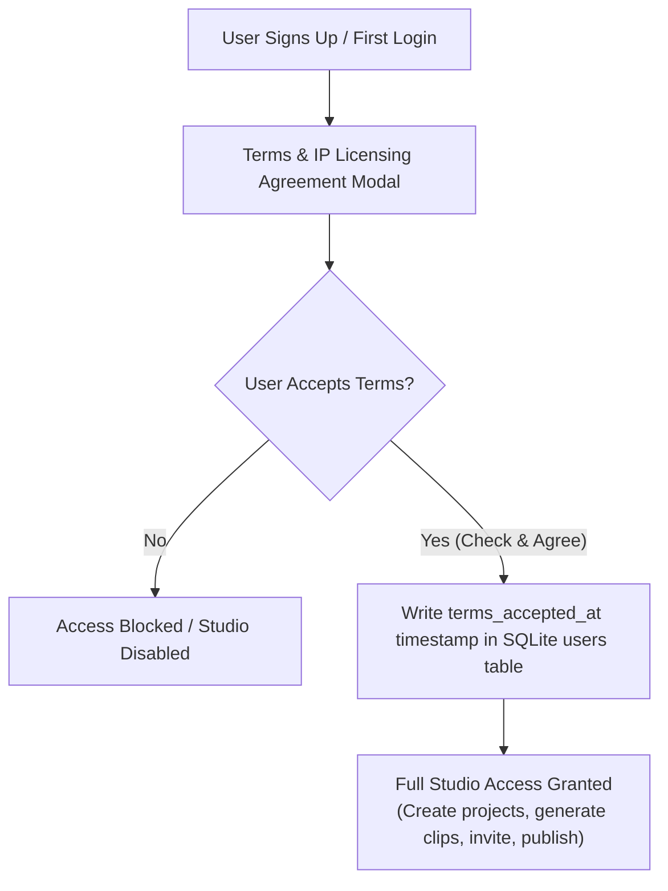

### Key Legal & Terms Elements

1. **User IP Warranty & Copyright Representation**:
   - The user certifies that any screenplay, book text, dialogue, character portrait, or prompt uploaded or adapted within PageToMovie is either:
     - **An original work** owned by the user,
     - **In the Public Domain** (e.g. classic literature like *The Tell-Tale Heart*), or
     - **Duly licensed** with explicit adaptation and AI generation rights from the copyright holder.
2. **PageToMovie Non-Liability & Disclaimer**:
   - PageToMovie operates solely as a creation platform and AI orchestration tool.
   - PageToMovie explicitly disclaims all liability and responsibility for copyright, trademark, or intellectual property infringement committed by users.
3. **User Indemnification Clause**:
   - Users agree to indemnify, defend, and hold harmless PageToMovie, its creators, operators, and hosting providers against any third-party claims, legal actions, damages, or costs resulting from the user's content or adaptations.
4. **Community Sharing & Public Gallery License**:
   - When a user chooses to publish a demo to the public gallery or share/fork an **open** project, the user grants PageToMovie a non-exclusive license to display the video via YouTube embeds and allow community collaborators to view/fork the blueprint metadata within the platform.
5. **DMCA Takedown & Enforcement Policy**:
   - PageToMovie reserves the right to immediately remove any project, demo, or content upon receiving a valid DMCA takedown notice or copyright dispute.

### Technical Enforcement in Code

- **SQLite Database**: `users` table extended with `terms_accepted_at TEXT` and `terms_version TEXT` columns via `UserDatabaseService.cs`.
- **UI Blocking Modal (`TermsAgreementModal.razor`)**: Displays on initial login or registration. Users must check the agreement box and click **"Agree & Continue"** before project creation or generation is allowed.
- **API Middleware**: Gated endpoints (`POST /api/projects`, clip generation, publishing) verify `terms_accepted_at != null`.

---

## Project Collaborators & Invite-to-Fork Workflow

### Intent
Instead of forcing multiple users to edit the same live project files simultaneously (which risks file lock conflicts and overwritten edits), PageToMovie uses an **Invite-to-Fork & Async Diff-Merge** collaboration model.

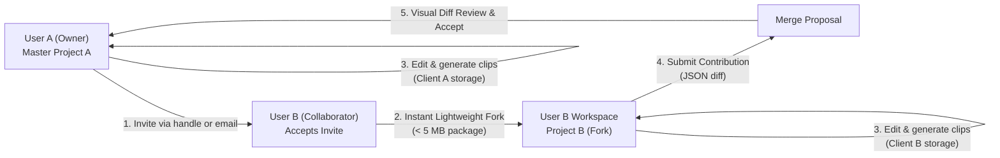

### Detailed Workflow & Security Model

1. **Privacy-Preserving Invitation & Search**:
   - Project Owner A opens the **Collaborate & Invite** modal in the UI.
   - *Public Handle Search (`@username`)*: Owner A types `@username` to search existing creator handles. The API queries SQLite `users` table (`username` column) and returns public handles only — **raw email addresses are never returned to the browser**.
   - *Blind Email Delivery*: Owner A can type a recipient's direct email address (`partner@example.com`). The server dispatches the invite link via Resend API without revealing to the client whether an account exists for that email.
   - *Zero DB Schema Changes*: SQLite `users` table already stores both `username TEXT NOT NULL UNIQUE` and `email TEXT`.
2. **Invitation Tokens & Acceptance (`/join?token=inv_...`)**:
   - The API generates a secure, 48-hour single-use token (`inv_...`).
   - When User B clicks the link (or accepts via in-app dashboard badge), PageToMovie executes `ForkProjectAsync`.
3. **Instant Lightweight Fork**:
   - Creates `Project A (Fork)` under User B's account (< 5 MB package containing Fountain script, cast seeds, reference images, and shot plan blueprint; excluding video binaries).
4. **Independent Local Work**:
   - User A and User B work independently on their own client storage (IndexedDB / OPFS / local PC folder). Neither user blocks or locks the other's workspace.
5. **Contribution Submission**:
   - User B completes edits (e.g. prompt tuning or beat timing changes) and clicks "Submit Contribution to Owner".
6. **Side-by-Side Visual Diff Review & Merge**:
   - Owner A receives a notification, views a side-by-side visual diff grouped by **Cast** and **Scenes/Clips** in `ContributionReview.razor`, and accepts/merges the changes into master `Project A`.

---

## Admin Cross-User Export & Client-Local Storage Handoff

### Intent
Enable Admin to transfer or export any project directly into any target user's project area, ensuring that video binaries end up stored locally on the target user's hard drive rather than eating up server disk space.

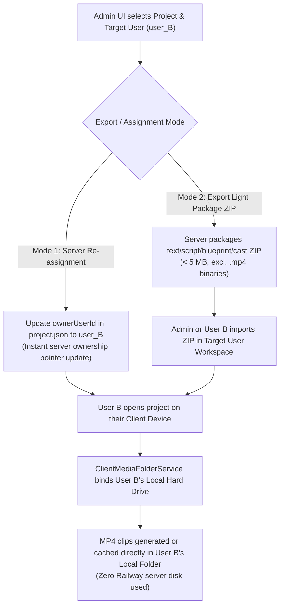

### Technical Workflow

1. **Lightweight Server Package / Re-assignment**:
   - The server project archive (`ProjectArchiveService.cs`) contains screenplay text, `cast_seeds.json`, character reference portraits (`assets/characters/*.png`), Stage 2 shot plan (`blueprint.clips.grok.json`), `project_rules.json`, and `pipeline_config.json`.
   - The server package is **100% lightweight (< 5 MB)** because heavy `.mp4` video binaries are excluded.
   - Admin specifies `targetUserId` in `Admin.razor`.
2. **Instant Ownership Transfer**:
   - The server writes `ownerUserId: "user_B"` into `project.json`.
   - The project immediately appears in User B's dashboard upon next login (`GET /api/projects` filtered by `ownerUserId == user_B`).
3. **Client-Local Hard Drive Binding**:
   - When User B logs in on their computer and opens the project in PageToMovie Studio, `ClientMediaFolderService.cs` binds User B's local hard drive directory (e.g. `C:\Users\UserB\PageToMovie\Projects\ProjectA\video\`).
   - Any video clips generated or synced by User B are saved directly to User B's local hard drive.
   - The Railway server remains at **0 MB video storage cost** for User B's project.

---

## Git-Backed Server Storage, Auto-Commit History & 3-Way Merge Engine

### Intent
Use **Git as the underlying storage and version control engine** for PageToMovie project state on the server (`LibGit2Sharp` / libgit2). Gives every project an automatic commit history, branch-based forking, and battle-tested **Git 3-way merge** for screenplays and blueprints.

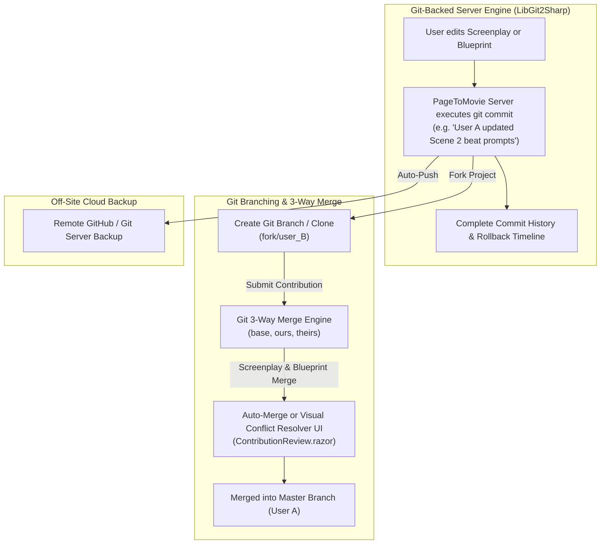

### Key Technical Capabilities

1. **Auto-Commit History**:
   - Every time a user updates a screenplay (`source/*.fountain`), modifies a shot prompt (`blueprint.clips.grok.json`), or edits cast seeds (`cast_seeds.json`), PageToMovie automatically creates a Git commit.
   - Users can view a **Revision History Timeline** in the UI and instantly restore any previous commit.
2. **Git 3-Way Screenplay & Blueprint Merging**:
   - Leverages Git's 3-way merge algorithm (`ours`, `theirs`, `base`) to merge Fountain screenplay line changes and JSON blueprint field edits when a collaborator submits a contribution.
   - Eliminates custom merge code by relying on battle-tested Git merge logic.
3. **Visual Conflict Resolver UI (`ContributionReview.razor`)**:
   - If User A and User B modified the exact same screenplay line or clip prompt, PageToMovie renders a visual 3-way diff editor showing **Original (Base)**, **Owner A (Ours)**, and **Collaborator B (Theirs)**.
4. **Remote GitHub Cloud Backup**:
   - The Railway server can automatically push project commits to GitHub (or any Git server) for off-site disaster recovery and backup.
   - `.gitignore` excludes `assets/video/*.mp4`, ensuring backup repos remain lightweight (< 5 MB).

### Dedicated GitHub Organization Strategy (`github.com/PageToMovie`)

To maintain professional branding, clean open-source packaging, and isolated API security, PageToMovie utilizes a **Dedicated GitHub Organization** (`PageToMovie` or `PageToMovie-App`):

- **Repository Structure**:
  - `https://github.com/PageToMovie/WebSite` — Primary Web App & Engine codebase repository.
  - `https://github.com/PageToMovie/Projects` — Dedicated film projects template & metadata repository.
  - `https://github.com/PageToMovie/GitUI` — Open-source Blazor Git UI Razor Class Library (NuGet package source).
- **Security & Token Isolation**:
  - Railway server uses a dedicated GitHub Personal Access Token (PAT) scoped strictly to the `PageToMovie` Organization.
  - Prevents automated Railway backup scripts from having access to personal repositories on your primary GitHub account (`budcribar`).
- **Owner Control**: Your personal GitHub account (`budcribar`) remains the primary administrator and owner of the `PageToMovie` GitHub Organization.

---

### Modular Blazor Git UI Razor Class Library (`PageToMovie.GitUi` / NuGet Package)

To benefit the broader .NET / Blazor developer community, all Git version-control UI components are architected as a **decoupled, reusable Razor Class Library (RCL)** designed for independent publication to **NuGet.org**:

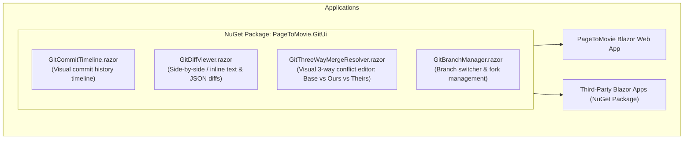

#### Key Design Standards for the NuGet Library:
1. **Generic Interfaces**: Bound to clean, abstracted interfaces (`IGitCommitProvider`, `IGitDiffModel`, `IGitMergeConflict`) rather than PageToMovie-specific entities.
2. **Vanilla CSS Token System**: Styled using CSS variables (`var(--git-added)`, `var(--git-deleted)`, `var(--git-accent)`) for seamless theme customization in any Blazor Server or WebAssembly application.
3. **Rich EventCallbacks**: Provides event hooks (`OnCommitSelected`, `OnConflictResolved`, `OnMergeAccepted`) allowing developers to extend behavior easily.

---

## Dedicated Projects Git Repository & Local Storage Architecture

### Intent
Separate the PageToMovie application codebase from user film project content. Enable creators to store and version-control their projects in a **dedicated Git repository** (e.g. `PageToMovie-Projects` or GitHub), keeping heavy `.mp4` video files stored locally on their PC hard drive (ignored by git).

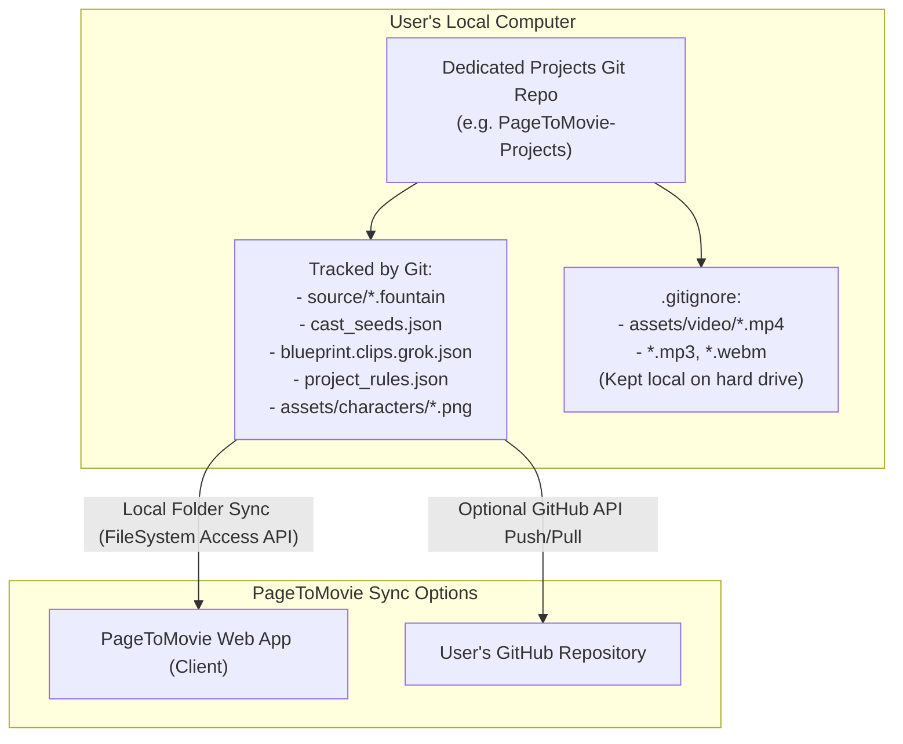

### Standard Repository Naming Convention & Directory Layout (`PageToMovie-Projects`)

- **Recommended Git Repository Name**: **`PageToMovie-Projects`**
  - Alternative names: `PageToMovie-Studio` or `FilmStudio-Projects`.
  - GitHub URL example: `https://github.com/budcribar/PageToMovie-Projects`
- **Standard Folder & File Layout**:
  ```text
  PageToMovie-Projects/
  ├── .gitignore                      # Ignores assets/video/*.mp4, *.mp3, *.webm
  ├── README.md                       # Dedicated film projects repository guide
  ├── Buster/                         # Film Project 1
  │   ├── project.json                # Metadata & owner settings
  │   ├── pipeline_config.json        # AI model & generation parameters
  │   ├── project_rules.json          # Project rules & constraints
  │   ├── cast_seeds.json             # Character definitions & prompt seeds
  │   ├── blueprint.clips.grok.json   # Stage 2 shot plan blueprint
  │   ├── source/
  │   │   └── screenplay.fountain     # Fountain screenplay source
  │   └── assets/
  │       ├── characters/            # Tracked by Git (character reference images)
  │       └── video/                 # Ignored by Git (local MP4 clips)
  │           ├── S01C01.mp4
  │           └── history/           # Local multi-version clip prompt history
  ├── B7/                             # Film Project 2
  └── The Tell-Tale Heart/            # Film Project 3
  ```

---

### Multi-Version Local MP4 History & Side-by-Side Prompt vs. Video Comparison

#### Intent
Enable creators to store multiple historical iterations of `.mp4` video clips on their local PC hard drive (indexed by Git Commit ID), allowing side-by-side visual comparison between prompt changes and video results. Teaches creators how specific prompt tweaks, dialogue parameters, and camera motion settings influence AI video generation.

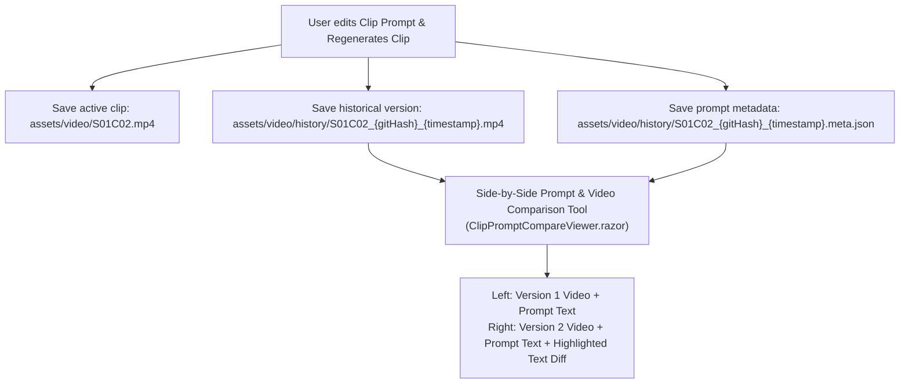

#### Architecture & Key Features:

1. **Local MP4 Version Storage (`assets/video/history/`)**:
   - When a clip is regenerated with updated prompts, previous `.mp4` versions are archived locally in `assets/video/history/S01C02_{gitCommitHash}_{timestamp}.mp4`.
   - Accompanied by a sidecar metadata JSON (`.meta.json`) recording the exact prompt text, visual prompt, seed, camera motion settings, AI model version, timestamp, and Git commit hash.
   - Heavy video files stay strictly on the creator's PC hard drive (ignored by `.gitignore`), resulting in **0 MB Railway server storage cost**.
2. **Side-by-Side Video & Prompt Comparison UI (`ClipPromptCompareViewer.razor`)**:
   - Displays a dual-player side-by-side video playback screen comparing **Version 1 (Previous Git Commit)** vs. **Version 2 (Current)**.
   - Includes a synchronized text diff highlighting exact prompt additions, deletions, and motion parameter changes.
   - Allows creators to visually evaluate how changing adjectives, lighting terms, or motion parameters impacted the AI video generation.

---

### Git LFS (Large File Storage) Evaluation & Strategy

We evaluated whether to use **Git LFS** (`git-lfs`) for `.mp4` video binary version control:

- **Default Recommendation (Ignored `.mp4` Binaries — Recommended)**:
  - **Strategy**: `.gitignore` ignores `assets/video/*.mp4`. Text, Fountain screenplays, character portraits, and blueprints are version-controlled in Git (< 5 MB per project). Video clips stay local on creator PC hard drives and stream publicly via YouTube embeds.
  - **Advantage**: **$0 storage & bandwidth fees**, zero risk of GitHub LFS quota errors (GitHub caps free LFS at 2 GB total).
- **Optional Opt-In (For Power Users / Studios with Custom LFS Servers)**:
  - Advanced studios who wish to version-control raw `.mp4` video clips across multiple machines using Git LFS can add `.gitattributes` to their project repository:
    ```gitattributes
    assets/video/*.mp4 filter=lfs diff=lfs merge=lfs -text
    assets/video/*.webm filter=lfs diff=lfs merge=lfs -text
    ```
  - PageToMovie's `ClientMediaFolderService.cs` supports Git LFS transparently because Git LFS operates at the local file system layer.

---

## Demo Gallery & YouTube Auto-Upload Pipeline

### Intent
Zero-server-disk public demo gallery powered by automated YouTube video uploads via YouTube Data API v3. Completely eliminates Railway disk usage and server streaming bandwidth for public demo videos while driving views and subscribers directly to your YouTube Channel.

### Architecture & Automated Workflow

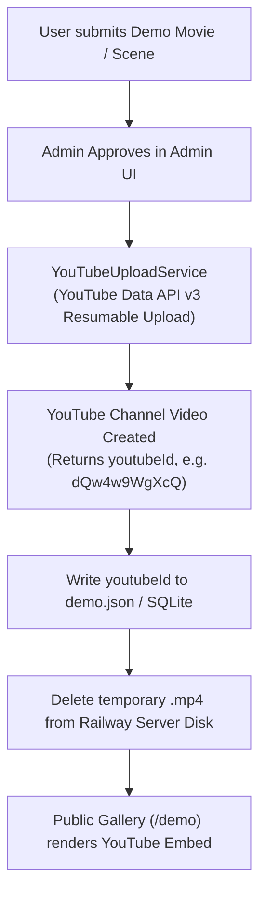

- **API Auto-Upload (`YouTubeUploadService.cs`)**:
  - Uses YouTube Data API v3 (`POST https://www.googleapis.com/upload/youtube/v3/videos?uploadType=resumable&part=snippet,status`).
  - Configured via OAuth2 credentials in Railway environment (`YouTube__ClientId`, `YouTube__ClientSecret`, `YouTube__RefreshToken`).
  - Upon demo approval, PageToMovie streams the MP4 video directly to your YouTube Channel as Public or Unlisted, sets the title, description, tags, and category, and retrieves the generated `youtubeId`.
- **Immediate Local Purge**: As soon as the upload completes, PageToMovie deletes the temporary `.mp4` file from Railway disk.
- **Embedded Playback**: The public `/demo` page renders an embedded, privacy-enhanced YouTube iframe player (`<iframe src="https://www.youtube-nocookie.com/embed/{youtubeId}"></iframe>`).
- **Manual Fallback**: Admin UI allows manual YouTube URL/ID pasting if an offline video was uploaded out-of-band.
- **Server Footprint**: **0 MB for video files**. `demo.json` / SQLite stores only metadata (title, author, screenplay snippet, upvote count, YouTube ID).

### Required YouTube Upload Metadata & Policy Declarations Form

YouTube Data API v3 (`videos.insert`) mandates specific metadata and policy disclosures for every uploaded video. When a user clicks **"Publish Demo to Gallery / YouTube"**, PageToMovie presents a metadata form (`PublishDemoModal.razor`) collecting:

| Field Name | Required / Policy | Description & Options | API Parameter (`videos.insert`) |
| :--- | :--- | :--- | :--- |
| **Movie Title** | Required | Max 100 characters. Defaults to project title + screenplay name. | `snippet.title` |
| **Logline / Description** | Required | Synopsis, author credit, and PageToMovie app link. | `snippet.description` |
| **Made for Kids Declaration** | **Mandatory (COPPA)** | `false` ("No, it's not made for kids") or `true`. Defaults to `false`. | `status.madeForKids` |
| **AI Synthetic Content Disclosure** | **Mandatory (YouTube AI Policy)** | Radio declaration: *"Contains AI-generated or synthetic visuals/audio."* Defaults to `true`. | `status.selfDeclaredMadeForKids` / AI disclosure flag |
| **Category ID** | Required | Default: `1` (Film & Animation) or `24` (Entertainment). | `snippet.categoryId` |
| **Privacy Status** | Required | `public`, `unlisted`, or `private`. Default: `public`. | `status.privacyStatus` |
| **Tags / Keywords** | Recommended | Comma-separated tags (e.g. `AI Movie, Fountain Screenplay, PageToMovie`). | `snippet.tags` |

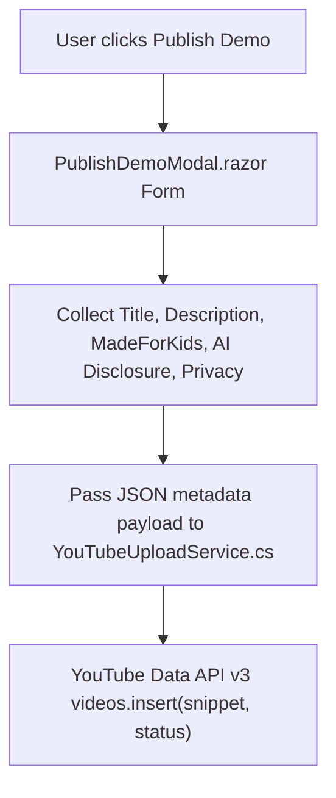

---

#### How Publishing & Automated Approval Work (Cryptographic Video Provenance)

PageToMovie maintains a cryptographic SHA-256 media audit log for every clip generated through the AI video pipeline (Grok / Veo / Luma). This allows **instant, trusted auto-approval** without manual admin waiting:

1. **Clip Provenance Hash Logging**: When clips are generated, PageToMovie computes and records their SHA-256 content hashes (`sha256:...`) in the server audit ledger (`pagetomovie.db` / `media_registry.json`).
2. **Automated Provenance Verification**:
   - When a user submits a demo movie, PageToMovie checks the SHA-256 hashes of all constituent video clips.
   - **Mode 1: Verified Trusted AI Provenance (Auto-Approved)**: If 100% of clip hashes match verified AI generation logs, the server marks the submission as **Trusted AI Content**, **bypasses the manual admin queue**, and **immediately triggers auto-upload to YouTube** via `YouTubeUploadService.cs`!
   - **Mode 2: Unverified / External Media (Manual Admin Review)**: If any clip hash is unknown (e.g. an externally uploaded video file that didn't originate from PageToMovie's AI pipeline), it is flagged as **Unverified Media** and routed to `/admin` for manual review.

#### How Modifications & Re-Publishing (Version 2) Are Handled
YouTube Data API does not allow swapping out the raw video bytes of an existing YouTube Video ID (to prevent video bait-and-switch). PageToMovie handles modified movie updates via **Versioned Pointer Replacement & API Cleanup** (**implemented** in `DemoYouTubePublisherService`):

1. **Re-publish** (default `replaceExisting: true`): if the project already has a **public** demo by this user with a `YoutubeId`, attach the new movie to that demo (no second gallery row).
2. **Upload Version 2**: `DemoYouTubePublisherService` uploads the new video and receives `newYoutubeId`.
3. **Update Gallery Pointer**: demo meta is updated with `youtubeId` / `youtubeUrl`; `/demo` embeds the new ID immediately.
4. **Mode A (API Delete)**: best-effort `videos.delete(oldYoutubeId)`. Requires channel OAuth with `youtube.force-ssl` (reconnect YouTube from Review if the token was issued with upload-only scope). If delete fails, V2 still wins in the gallery; v1 may remain on the channel for manual cleanup.
   - *Mode B (Archive — not implemented)*: could unlisted + rename old title; Mode A is the default path today.

### YouTube Data API v3 Quotas & Quota Management Strategy

- **Default Free Quota Budget**:
  - Google Cloud provides a default free quota of **10,000 units per day**.
  - A video upload request (`videos.insert`) costs **~1,600 units**.
  - This allows **~6 automated video uploads per day** on a new Google Cloud project.
- **Handling & Mitigation Strategy**:
  1. **Daily Upload Cap**: PageToMovie tracks daily upload count in `YouTubeUploadService.cs` and caps auto-uploads at 5 per day to prevent unexpected API quota errors.
  2. **Manual Paste Fallback**: If the daily API quota limit is reached, the Admin UI displays an option for the Admin to paste a YouTube Video ID/URL directly for instant gallery embedding.
  3. **Free Quota Increase Request**: As public channel publishing volume grows, a free quota extension request can be submitted in [Google Cloud Console Quotas](https://console.cloud.google.com/iam-admin/quotas) to raise the daily limit to **100,000+ units per day** (allowing 60+ automated uploads/day).

---

### Step-by-Step Setup Guide: Creating & Connecting Your PageToMovie YouTube Channel

#### Step 0: Create Your Dedicated "PageToMovie" Brand YouTube Channel
1. Open [YouTube.com](https://www.youtube.com) signed in with your Google account.
2. Go to [youtube.com/channel_switcher](https://www.youtube.com/channel_switcher).
3. Click **Create a channel**, name it **PageToMovie** (or **PageToMovie Studio**), check the agreement box, and click **Create**.
4. In [YouTube Studio](https://studio.youtube.com) $\rightarrow$ **Customization**, set your handle (`@PageToMovie`), bio, logo avatar, and website link (`https://pagetomovie-production.up.railway.app`).
5. In **Settings** $\rightarrow$ **Channel** $\rightarrow$ **Feature Eligibility**, complete **Phone Verification** to unlock custom thumbnails and long/unlisted video uploads for API integration.

#### Step 1: Create Google Cloud Project & Enable YouTube Data API v3
1. Open the [Google Cloud Console](https://console.cloud.google.com/).
2. Click the project dropdown in the top bar and select **New Project**. Name it `PageToMovie Studio` and click **Create**.
3. In the left navigation menu, go to **APIs & Services** $\rightarrow$ **Library**.
4. Search for `YouTube Data API v3`, click it, and click **Enable**.

#### Step 2: Configure OAuth Consent Screen
1. Go to **APIs & Services** $\rightarrow$ **OAuth consent screen**.
2. Select **External** (or Internal if using Google Workspace) and click **Create**.
3. Enter App Name (`PageToMovie`), User support email, and Developer contact email. Click **Save and Continue**.
4. In the **Scopes** tab, click **Add or Remove Scopes**, search for `youtube.upload`, check `https://www.googleapis.com/auth/youtube.upload`, and click **Update** $\rightarrow$ **Save and Continue**.
5. In the **Test Users** tab, add your Google account email associated with your YouTube Channel. Click **Save and Continue**.

#### Step 3: Create OAuth2 Client ID & Client Secret
1. Go to **APIs & Services** $\rightarrow$ **Credentials**.
2. Click **Create Credentials** $\rightarrow$ **OAuth client ID**.
3. Set **Application type** to **Web application**.
4. Set **Name** to `PageToMovie YouTube Uploader`.
5. Under **Authorized redirect URIs**, click **Add URI** and enter:
   - `https://developers.google.com/oauthplayground`
6. Click **Create**.
7. Copy your **Client ID** (`YouTube__ClientId`) and **Client Secret** (`YouTube__ClientSecret`).

#### Step 4: Generate Refresh Token (via Google OAuth 2.0 Playground)
1. Open [Google OAuth 2.0 Playground](https://developers.google.com/oauthplayground).
2. Click the gear icon ⚙️ in the upper right corner:
   - Check **Use your own OAuth credentials**.
   - Paste your **OAuth Client ID** and **OAuth Client Secret**.
3. In the left panel under **Step 1 Select & authorize APIs**:
   - Scroll down to **YouTube Data API v3**.
   - Expand it and check `https://www.googleapis.com/auth/youtube.upload`.
   - Click the blue **Authorize APIs** button.
4. Log in with the Google Account that owns your YouTube Channel and click **Continue / Allow**.
5. In **Step 2 Exchange authorization code for tokens**:
   - Click the blue **Exchange authorization code for tokens** button.
6. Copy the generated **Refresh Token** (`YouTube__RefreshToken`).

#### Step 5: Configure Railway Environment Variables
In your Railway Dashboard $\rightarrow$ **Variables** (or local `appsettings.json` / environment):

| Variable Name | Example Value |
| :--- | :--- |
| `YouTube__ClientId` | `123456789-abcdef.apps.googleusercontent.com` |
| `YouTube__ClientSecret` | `GOCSPX-abc123xyz456...` |
| `YouTube__RefreshToken` | `1//04abc123xyz...` |

---

## Client Media Storage & Server Media Pruner

### Intent
Keep generated MP4 clips and scene previews on client devices while enforcing a strict capacity guard on Railway server disk space.

### Architecture
- **Client Storage**: Gen clips save into a user-picked local folder (File System Access API / Chrome–Edge) via `ClientMediaFolderService.cs` + `pagetomovie-media.js`. Index/OPFS remain future options; today the primary path is the local PC folder.
- **Job handoff**: On clip gen, the engine can set `JobSnapshot.ClientMediaUrl` (short-lived `/api/media/proxy/{ticket}`) + `ClientRelativePath` so the browser downloads instead of relying only on server disk.
- **Browser Stitching**: `ClientVideoStitchService.cs` uses **ffmpeg.wasm** in the Blazor client to compile scene/screenplay movies locally (prefers local blob when the folder is connected).
- **Server Media Pruner (`ServerMediaPruningService.cs`)**: Hosted background service that can purge server-cached `.mp4` under workspace `projects/…/assets/video/` with sync-safe rules; **opt-in** via `PageToMovie:MediaPruning:Enabled` (defaults off).

### Status (as of 2026-07-26)

| Piece | Status | Notes |
|-------|--------|--------|
| Proxy ticket + client download path | ✅ | Grok/credits handoff sets `ClientMediaUrl` |
| Folder picker + SHA-256 register | ✅ | `Connect media folder` (Nav + Scenes) |
| Auto-save on job **done** | ✅ | Hub hook from `MainLayout` + Scenes; ignore `running` to avoid double-save |
| **Fallback when folder not connected (feature 8)** | ✅ | One-shot Scenes warning + **Connect folder** / Dismiss; Chrome/Edge copy when API unsupported (`6769a93`) |
| Silence trim before local write | ✅ | ffmpeg.wasm + `ClipSilenceTrimmer` |
| Stream proxy (no full RAM buffer) | 🔲 planned | See [archive/client-storage-implementation-plan.md](archive/client-storage-implementation-plan.md) step 1 |
| `.client.json` marker on register | 🔲 planned | Step 3 — UI “present” without server MP4 |
| Proactive “connect folder” banner | 🔲 planned | Step 4 (distinct from feature-8 post-gen warning) |
| Prune server MP4 when client marker exists | 🔲 planned | Step 5 |
| Folder name persistence | 🔲 planned | Step 6 |
| `ClientStorageMode` skip server write | 🔲 planned | Step 7 — only after 1–5 proven |

**Detail plan (archived):** [`docs/archive/client-storage-implementation-plan.md`](archive/client-storage-implementation-plan.md)

---

## Technical Component & File Map

| Component | Target File | Responsibility |
|-----------|-------------|----------------|
| **YouTube API Auto-Uploader** | [YouTubeUploadService.cs](file:///C:/Users/budcr/source/repos/gemini/PageToMovie/host/PageToMovie.Engine/YouTubeUploadService.cs) | YouTube Data API v3 OAuth2 resumable upload & server disk auto-purge. |
| **Privacy Search & Invite API** | [Program.cs](file:///C:/Users/budcr/source/repos/gemini/PageToMovie/host/PageToMovie.Api/Program.cs) | Gated `GET /api/users/search`, `POST /api/projects/{id}/invites`, and `/join` invite acceptance. |
| **Invite UI Modal** | [ProjectCollaboratorsModal.razor](file:///C:/Users/budcr/source/repos/gemini/PageToMovie/host/PageToMovie.Web/Components/Modals/ProjectCollaboratorsModal.razor) | Modal with handle search (`@username`) and blind email invite input. |
| **Lightweight Forking** | [ProjectArchiveService.cs](file:///C:/Users/budcr/source/repos/gemini/PageToMovie/host/PageToMovie.Engine/ProjectArchiveService.cs) | `ForkProjectAsync` creates < 5 MB text/metadata project forks excluding video binaries. |
| **YouTube Gallery UI** | [Demo.razor](file:///C:/Users/budcr/source/repos/gemini/PageToMovie/host/PageToMovie.Web/Components/Pages/Demo.razor) | Privacy-enhanced YouTube iframe player embed (`youtube-nocookie.com`). |
| **Creator Profile Service** | [CreatorProfileService.cs](file:///C:/Users/budcr/source/repos/gemini/PageToMovie/host/PageToMovie.Engine/CreatorProfileService.cs) | Dynamically computes movies published, total upvotes, forks spawned, and badges. |
| **Creator Profile Header UI** | [CreatorProfileHeader.razor](file:///C:/Users/budcr/source/repos/gemini/PageToMovie/host/PageToMovie.Web/Components/Pages/CreatorProfileHeader.razor) | Visual header component rendering user handle, stat pills, and badge chips. |
| **Contribution & Diff Service** | [ProjectContributionService.cs](file:///C:/Users/budcr/source/repos/gemini/PageToMovie/host/PageToMovie.Engine/ProjectContributionService.cs) | Computes line-by-line diffs across screenplay, cast seeds, shot plan, and rules. |
| **Contribution Review UI** | [ContributionReview.razor](file:///C:/Users/budcr/source/repos/gemini/PageToMovie/host/PageToMovie.Web/Components/Pages/ContributionReview.razor) | Visual diff review component (`/projects/{id}/review-contribution`) with Accept & Sync and Reject actions. |

---

## Suggested Ship Order (Phased Roadmap)

All six phases below were re-verified and, where the original commits were unwired or stubbed,
reimplemented for real (see the status table and `host/docs/issues/` for what's still deliberately
out of scope, e.g. automatic Git auto-commit and the public gallery "Fork Project" button).

1. **Phase 1: Client MP4 Storage & Server Media Pruner (`ServerMediaPruningService.cs`)** — done for real: workspace-root-aware, sync-checked, off by default.
2. **Phase 2: User Terms of Service & IP Licensing Agreement (`TermsAgreementModal.razor`)** — done for real: `AuthGate.RequireTermsAcceptedAsync` actually gates project create/gen/publish, not just a client-side modal.
3. **Phase 3: YouTube API Auto-Upload & Required Metadata Form (`DemoYouTubePublisherService.cs`)** — done for real: demos migrate to YouTube automatically on approval, reusing the existing working OAuth connection.
4. **Phase 4: Multi-Version Local MP4 History & Side-by-Side Prompt Comparison (`ClipPromptCompareViewer.razor`)** — done for real: built the clip-version history mechanism that didn't exist, then wired the viewer to it.
5. **Phase 5: Git-Backed Server Engine (`LibGit2Sharp`)** — done for real: genuine commits and 3-way merge with real conflict detection, reachable via gated endpoints (not yet an automatic background hook — see issue-26). The `PageToMovie.GitUi` NuGet package extraction was not attempted.
6. **Phase 6: Privacy-Preserving User Invites, Invite-to-Fork Collaboration & Visual Diff Review** — done for real: persisted single-use email invites, `/join` acceptance, lightweight forking, Creator Profile Badges & Stats (Feature 14), and Contribution Accept/Reject & Conflict Review UI (`ContributionReview.razor` — Feature 8), end-to-end tested.

---

*Last updated: 2026-07-26 — Feature 11 gallery **Fork project** button + `POST /api/demos/{id}/fork` shipped. Prior: Feature 6 (fork banner/sync), Feature 8 (contribution review UI), YouTube V2 replace, Feature 14 (creator profiles). Remaining community planned items: visibility modes (#3), media-aware contribution PRs (#10).*
