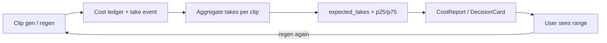
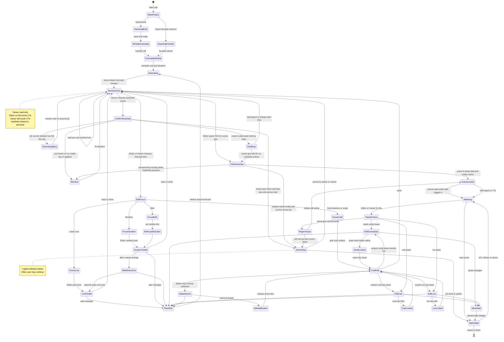

# Studio decision flow — plan & checklist

**Status:** living plan (product + engineering)  
**North star:** Generate the whole movie → watch → tweak → surgical regen.  
**Pre-gen spine:** Import (**book** *or* **fountain shortcut**) → estimate (tiered) → **Decision card** → Generate **or** Edit → re-estimate → Generate.  
**Multi-user:** one project, shared plan/clips/ledger; roles + scene/script leases gate who can change what.

Cost is never a hard dollar gate. Preferences bias defaults; the user always chooses.

---

## 1. Principles

| # | Principle |
|---|-----------|
| 1 | **Film is home after gen.** Craft pages (script / cast / locs) are fix tools. |
| 2 | **Cost + duration are forecasts** on the current plan, not a final invoice. |
| 3 | **Estimate fidelity improves** (screenplay → shot plan → remaining). Never block the decision card waiting for perfect clip count. |
| 4 | **Generate vs Edit** is the only pre-gen fork. No forced cast→locs→trim tour. |
| 5 | **Edit focus** (cost / duration / both / craft) chooses tool order, not different physics. Cost and duration are correlated. |
| 6 | **Remember choices** (path, focus, runtime target) **per user**; project forecast is shared. Still show $ + minutes every time. |
| 7 | **Surgical regen + stale markers** are how the product ages when full gen is cheap. |
| 8 | **Regen feedback loop** — measure real takes-per-clip and reasons so estimates (and ranges) improve with usage. |
| 9 | **Two import paths:** book→screenplay *or* **import fountain** (skip write) — both land on the same DecisionCard. |
| 10 | **Shared projects:** Owner full-film / Editor scene gen; job service; `keyMode` shared\|personal; leases on script, scene, cast, loc; no steal while online. |


---

## 2. Progressive costing model

### Catch-22 (resolved)

Exact video $ needs clip count; clip count needs a shot plan; shot plan and scene count depend on runtime/cast choices that users make *because of* cost.  

**Resolution:** show a **tiered estimate** with **basis + confidence**. Re-enter `Estimating` after every material plan change.

### Estimate tiers

| Tier / basis | When | Duration source | Cost source | Confidence |
|--------------|------|-----------------|-------------|------------|
| `none` | Before usable screenplay | — | Planning LLM only (rough) | Very low — don’t use as DecisionCard primary |
| `screenplay` | Fountain ready, no shot plan | Natural runtime / scene heuristics / target if set | Synthetic clips: `f(scenes, target_min, avg_clip_sec) × $/clip` + LLM planning | **Rough band** — DecisionCard OK |
| `shot_plan` | Stage‑2 blueprint has clips | Sum of planned clip durations | Real clip count × model rates | **Good** pre-gen |
| `remaining` | Gen in progress or partial | Actual + planned missing | Spent ledger + missing clips | **Best** operational |

Implementation note (current engine): `CostReportService` already sets `EstimateBasis` to `shot_plan` or falls back to screenplay-derived clips (`screenplay`). Decision UI must **surface basis** and prefer **ranges** on `screenplay`.

### What moves the forecast

| Change | Duration | Video $ | Plates $ |
|--------|----------|---------|----------|
| Runtime target / trim / fit | Yes | Yes (clips scale) | Small |
| Cast size / speaking cast | Small | Small–medium | Yes |
| Location plates | No | No (attach only) | Yes (gen plates) |
| Resolution (480/720/1080) | No | Yes | No |
| Shot plan refine | Yes (exact) | Yes (exact) | — |
| Gen some clips | Actual media | Spent ↑ remaining ↓ | — |
| **User regen (N takes)** | No | **× takes factor** | — |

### DecisionCard always shows

```text
~{duration_label}  ·  ~${cost_label}  ·  basis: {screenplay|shot_plan|remaining}
[ Generate movie ]    [ Edit plan first ]
```

Optional: low–high band when basis is `screenplay`.

### Cost formula (point + range)

```text
point_$ ≈ clips × $/clip × expected_takes
low_$   ≈ clips × $/clip × takes_p25   (or 1.0 if cold start)
high_$  ≈ clips × $/clip × takes_p75   (or default_prior if cold start)
```

| Term | Source |
|------|--------|
| `clips` | Tier: synthetic or shot plan |
| `$/clip` | Model catalog rates × resolution |
| `expected_takes` | **Learned** from regen telemetry (global → segment → project), else prior (e.g. QA mult ~1.3) |
| Range | Percentiles of takes/clip, not a guessy ±% only |

**Cold start prior** (until enough samples): use existing QA/history path (`qa_retry_video_multiplier` / `BuildHistoryRefinementAsync` in `CostReportService`) as `expected_takes`. Replace/blend as regen events accumulate.

---

## 2b. Regen feedback loop (learn real cost)

### Why

First-pass estimate undercounts if people typically regen scenes 2–3×.  
Tracking **how often and why** people regenerate turns “we think 1.0×” into “p50 is 1.4×, dialogue scenes 1.8×” and tightens DecisionCard ranges over time.

Related but different:

| System | Learns | Feeds |
|--------|--------|--------|
| [learning_loop.md](./learning_loop.md) | *What* was wrong (prompts, stage1/2) | Better next plan/render quality |
| **Regen cost loop (here)** | *How many takes* and cost impact | Better $ forecasts / ranges |
| QA auto-retry (existing) | Fail rates → video multiplier | Automatic quality regens |

### Events to log (every video take)

Write one durable row per successful (or billed) clip generation:

| Field | Example |
|-------|---------|
| `project_id`, `user_id` (hash ok) | |
| `scene`, `clip`, `stable_beat_id?` | |
| `take_index` | 1 = first gen, 2+ = regen |
| `trigger` | `initial` \| `user_regen` \| `stale_regen` \| `qa_auto` \| `fill_holes` |
| `reason` | optional: `dialogue` \| `look` \| `motion` \| `audio` \| `other` \| null |
| `model`, `resolution` | |
| `list_usd`, `duration_sec` | from ledger |
| `had_char_refs`, `had_loc_ref` | bools |
| `minutes_since_prev_take` | |
| `ts` | |

Aggregate offline or on a schedule (not every request if heavy):

| Metric | Grain |
|--------|--------|
| `takes_per_clip` mean / p25 / p50 / p75 | global |
| same | by `trigger`, model, resolution |
| same | by scene type heuristic later (dialogue-heavy vs action) |
| `regen_rate` = share of clips with take_index ≥ 2 | global / weekly |
| `user_regen_rate` vs `qa_auto_rate` | separate — user taste vs gate |

### How estimates consume it

```text
CostReportService / DecisionCard:
  prior_takes = history QA mult (existing)
  learned_takes = telemetry.p50_takes (min N samples)
  expected_takes = blend(prior, learned, weight=f(N))
  point = clips × rate × expected_takes
  range = clips × rate × [p25, p75]  (floor low at 1.0× first-pass)
```

Show on DecisionCard when range is wide:

```text
~$32–$58  ·  typical ~1.5 takes/clip from studio history  ·  basis: shot_plan
```

Admin later: chart takes/clip over time, top regen reasons (if collected).

### Privacy / product rules

- Prefer **aggregated** learning (global + optional per-user private mult); don’t leak other users’ projects.  
- Reason codes optional (one-click after regen, not a form wall).  
- Never block gen if telemetry write fails.  
- Opt-out of “contribute to studio averages” possible later; project still gets its own remaining estimate from ledger.

### Feedback loop diagram



---

## 3. Entry paths (book vs fountain)

Both converge on **ScreenplayReady → Estimating → DecisionCard**. Fountain is a **shortcut**, not a different product.

| Path | Steps | Skips | Lands on |
|------|--------|--------|----------|
| **Book import** | Import book text → write/adapt fountain (LLM job) | — | ScreenplayReady |
| **Fountain import** | Upload / paste `.fountain` (or re-import screenplay) | WritingScreenplay job | ScreenplayReady **directly** |

```text
NeedProject
  ├─ Import book ──────────► WritingScreenplay ──► ScreenplayReady
  └─ Import fountain ────────────────────────────► ScreenplayReady   ← shortcut
                              ScreenplayReady ► Estimating ► DecisionCard ► …
```

After fountain import, cast/loc seeds and shot plan may still be missing — same as post-book: **estimate on `screenplay` basis**, then Generate (may run cast extract / stage‑2 as job steps) or Edit.

---

## 3b. Multi-user projects (how sharing fits)

### What already exists (engine)

| Concept | Implementation |
|---------|----------------|
| **ACL** | `ProjectAclDocument`: Owner, Editors[], Viewers[], pending invites (`ProjectAclService`) |
| **Roles** | `Owner` > `Editor` > `Viewer` > `None` |
| **Leases** | `IProjectLeaseService` — resource keys e.g. `project`, `scene:3`, `script` (TTL, acquire / renew / transfer; 423 on conflict) |
| **Presence** | `IProjectPresenceService` — who’s online on the project |
| **Scene lock UI** | `SceneSummary.LockOwnerUserId`, `LockedByOther` on Film list/detail |
| **Shared cost** | Project ledger / `ProjectCostAggregator` — one spend story per project |

### Policy (who decides what) — adopted

**No votes.** Job service serializes spend work. Leases serialize writers. Collab = **split by scene**, not two writers on one scene.

#### P1–P6 decisions

| # | Question | Decision |
|---|----------|----------|
| **P1** | Two people start gen / job races | **Job service** is source of truth: one active job of a given scope; second client attaches/monitors (`GeneratingBusy`), does not double-start |
| **P2** | Whose API keys / credits? | **Either model:** (a) **shared project keys** (Owner configures project BYOK) or (b) **individual user keys** (each Editor spends on their own key). Project setting: `keyMode = shared \| personal`. Take events always log `user_id` |
| **P3** | Who may Generate what? | **Owner:** full movie + scenes. **Editor (collaborator):** **scene / clip gen only** — not “Generate whole movie”. While plan/`script` is busy, full-film stays blocked; **unlocked scenes may still gen** |
| **P4** | Steal lease? | **No steal while holder is logged in / present.** On **logout or presence expiry**, leases release so the other user can continue. TTL covers crashed sessions. No peer force-take while both online |
| **P5** | Cast / location plates | **Both require leases** while editing/locking: `cast:{key}`, `loc:{key}` — not last-write-wins |
| **P6** | Structure changes | **Reorder scenes:** allowed with `script` lease. **Delete scene:** **forbidden if that scene is locked** (`scene:N` held by anyone, including self mid-gen); unlock/release first |

#### Roles

| Role | May do | May not |
|------|--------|---------|
| **Owner** | ACL/invites; set `keyMode` + shared keys if used; **Generate whole movie**; scene gen; all Edit toolkits; cancel any job; (leases still apply) | Steal lease while other still online |
| **Editor** | Edit plan/craft with leases; **Generate / regen scenes & clips** (not full movie); cancel jobs **they** started | Change ACL; **Generate whole movie**; steal lease while holder online |
| **Viewer** | Watch, read $ forecast, review | Any gen, edit, leases |

#### Resource locks

| Resource | Lease key | Rule |
|----------|-----------|------|
| Screenplay text + **reorder** | `script` | One writer; others read-only |
| **Delete scene** | `script` + scene must be **unlocked** | Block delete if `scene:N` held |
| Scene edit + clip/scene gen | `scene:N` | One Editor per scene; others watch |
| Full-film gen job | Job service + `project:gen` | **Owner only** to *start*; one active full-film job |
| Cast plate edit/lock | `cast:{key}` | Required (P5) |
| Loc plate edit/lock | `loc:{key}` | Required (P5) |

#### Conflict → resolution

| Conflict | Resolution |
|----------|------------|
| A and B start work that needs a job | **Job service**: first job runs; second → **GeneratingBusy** (monitor), no double bill (P1) |
| Editor B clicks **Generate movie** | **Forbidden** — only **Owner** (P3). B uses per-scene generate |
| Owner full-film while Editor holds `script` / plan dirty | **PlanBusy** for full-film; Editor may still gen **other unlocked scenes** |
| A holds `scene:12`, B opens 12 | **SceneLocked** — watch OK; no edit/regen until A logs out / TTL / release |
| Both online, B wants A’s lease | **Cannot steal** (P4) |
| A logs out | Leases released → B can acquire and continue (P4) |
| Shared vs personal keys | `keyMode` (P2); gen uses project key or actor’s key accordingly |
| A and B edit same cast/loc | Second gets **CastLocked** / **LocLocked** until release (P5) |
| Reorder while B on scene 5 | Reorder OK with `script` lease; scene 5 lease independent |
| Delete scene 5 while locked | **Blocked** until `scene:5` free (P6) |
| Prefers Generate vs Edit | Not a conflict — per-user chrome; shared forecast |

#### DecisionCard under multi-user

- **One project forecast** (basis, clips, spent, remaining, rev).  
- **Per-user chrome:** prefs; presence (“Also online: …”).  
- **Owner:** primary CTA can be **Generate movie**.  
- **Editor:** primary CTA is **Edit** / open Film for **scene gen** — no full-movie confirm (or show disabled + “Owner starts full movie”).  
- **Confirm full-film:** Owner + fresh estimate + job service free + not PlanBusy.  
- **Scene gen:** Editor+ + `scene:N` + job service accepts scene job + keyMode resolved.  
- Leases release on **logout** and presence expiry (P4).

#### Keys (P2) detail

```text
keyMode = shared
  → gen charges project/Owner-configured keys (all Editors use them for scene gen)
keyMode = personal
  → each Editor must have their own key; gen fails for that user if missing
  → Owner full-film uses Owner’s key (or project shared override if set)
```

Take events always store `user_id` + which key scope was used.

#### Regen telemetry (multi-user)

- Take events include `user_id`.  
- Project calibration shared; global averages anonymized (Phase H).  
- Prefs never cross users.

#### Fit into the state machine (guards)

| Transition | Guard (policy) |
|------------|----------------|
| DecisionCard **Generate movie** enabled | **Owner** only (P3); Viewer never; Editor sees scene-oriented path |
| DecisionCard **Edit** | ACL ≥ Editor |
| → EditScreenplay / reorder | ACL ≥ Editor + `script` lease |
| → **Delete scene N** | `script` lease + **`scene:N` not held** (P6) |
| → Cost/Duration toolkits | ACL ≥ Editor |
| → ConfirmGenerate (**full film**) | **Owner** + fresh estimate + not PlanBusy + job service free |
| → Generating full film | Job service start + `project:gen` |
| → RegenScope / scene gen | ACL ≥ Editor + `scene:N` + job service (P1, P3) |
| → EditCast / lock plate | `cast:{key}` lease (P5) |
| → EditLocs / lock plate | `loc:{key}` lease (P5) |
| → Watching | ACL ≥ Viewer |
| Cancel job | Starter or Owner |
| Steal lease while holder present | **Never** (P4) |
| Lease release | Explicit release, **logout**, presence expiry, TTL |

---

## 4. State machine

### Happy path (summary)

```text
Import book → WritingScreenplay ─┐
Import fountain (shortcut) ──────┴► ScreenplayReady → Estimating → DecisionCard
    ├─ Owner: Generate movie → ConfirmGenerate → job service → Generating → Watchable
    ├─ Editor: scene gen from Film (not full movie) → scene lease → job service → Generating
    └─ Edit → EditFocus → toolkit → PlanDirty → Estimating → DecisionCard
         P1 job service · P2 shared|personal keys · P3 Owner full-film · P4 no steal if online
         P5 cast+loc leases · P6 reorder OK / no delete if scene locked
```

### Full state diagram (with multi-user policy)



### Guard detail (tabular)

```text
ConfirmGenerate (full movie)
  ├─ not Owner                         → Blocked
  ├─ job service has active full-film  → GeneratingBusy   (P1)
  ├─ script/plan held by other         → PlanBusy
  ├─ keyMode/personal key unresolved   → Blocked          (P2)
  ├─ re-fetch estimate fails           → Blocked or Estimating
  └─ else job service start            → Generating

FilmSceneGen / RegenScope (scene N)    (P3 Editors OK)
  ├─ ACL < Editor                      → Blocked
  ├─ scene:N held and holder online    → SceneLocked      (P4 no steal)
  ├─ job service rejects parallel same scene → GeneratingBusy
  ├─ keyMode personal and no user key  → Blocked          (P2)
  └─ else acquire scene:N + job start  → Generating

DeleteScene(N)                         (P6)
  ├─ no script lease                   → ScriptLocked / acquire
  ├─ scene:N held                      → DeleteBlocked
  └─ else delete                       → PlanDirty

EditCast(key) / EditLocs(key)          (P5)
  ├─ cast:key or loc:key held          → CastLocked / LocLocked
  └─ else acquire + edit

Lease release: explicit | logout | presence expiry | TTL
Steal while both logged in: NEVER      (P4)
```

### Edit focus (cost / duration / both / craft)

  ConfirmGenerate --> Blocked: Viewer or no credits key or pipeline
  ConfirmGenerate --> GeneratingBusy: project gen job already running
  ConfirmGenerate --> PlanBusy: script or plan lease held by other
  ConfirmGenerate --> Generating: Editor plus fresh estimate plus acquire project gen

  GeneratingBusy --> DecisionCard: monitor wait no second job
  PlanBusy --> DecisionCard: wait for editor or Owner force release
  Blocked --> DecisionCard: fix blockers

  Generating --> Watchable: job done or partial
  Generating --> DecisionCard: cancel by starter or Owner

  EditFocus --> FocusCost: Lower cost
  EditFocus --> FocusDuration: Runtime
  EditFocus --> FocusBoth: Both
  EditFocus --> FocusCraft: Cast locations or script

  FocusCost --> CostToolkit: Editor plan tools
  CostToolkit --> PlanDirty: plan changed
  CostToolkit --> DecisionCard: back or done

  FocusDuration --> DurationToolkit: Editor runtime tools
  DurationToolkit --> PlanDirty: plan changed
  DurationToolkit --> DecisionCard: back or done

  FocusBoth --> BothLeadDuration: set runtime first
  BothLeadDuration --> DurationToolkit
  DurationToolkit --> BothShowCost: after runtime change
  BothShowCost --> CostToolkit: optional extra cost cuts
  BothShowCost --> PlanDirty

  FocusCraft --> CraftHub: pick craft surface
  CraftHub --> EditScreenplay: acquire script lease
  CraftHub --> EditCast: plate save last write or cast lease
  CraftHub --> EditLocs: plate save last write or loc lease
  EditScreenplay --> ScriptLocked: lease held by other
  ScriptLocked --> CraftHub: read-only script
  EditScreenplay --> PlanDirty
  EditCast --> PlanDirty
  EditLocs --> PlanDirty
  CraftHub --> DecisionCard: back

  PlanDirty --> Estimating: refresh shared forecast

  Watchable --> Watching: ACL Viewer or above
  Watching --> Watchable: next scene
  Watching --> TweakChoice: Editor fix this

  TweakChoice --> EditScreenplay: edit line needs script lease
  TweakChoice --> EditCast: fix face or voice
  TweakChoice --> EditLocs: fix set
  TweakChoice --> RegenScope: scoped regen

  EditScreenplay --> MarkStale: inputs changed
  EditCast --> MarkStale
  EditLocs --> MarkStale
  MarkStale --> Watchable: shared stale badges

  RegenScope --> SceneLocked: scene N lease held by other
  SceneLocked --> Watching: view only until free
  RegenScope --> Generating: acquire scene N then gen takes

  Watchable --> [*]: export or done
```

### Guard detail (same diagram, tabular)

```text
ConfirmGenerate
  ├─ ACL < Editor                    → Blocked
  ├─ project:gen held / job running  → GeneratingBusy
  ├─ script lease held by other
  │    OR unsaved plan dirty by other → PlanBusy
  ├─ re-fetch estimate fails / $0 unknown → Blocked or wait Estimating
  └─ else acquire project:gen        → Generating

RegenScope(scene N)
  ├─ ACL < Editor          → Blocked (or hide)
  ├─ scene:N held by other → SceneLocked → Watching
  └─ else acquire scene:N  → Generating (clip/scene scope)

EditScreenplay
  ├─ acquire script OK → edit → PlanDirty
  └─ held by other     → ScriptLocked (read-only)

Parallel OK: user A scene:3 + user B scene:7
Not OK: two full-film gens; two writers on script; two regens same scene
```

### Edit focus (cost / duration / both / craft)

| Focus | Entry order | Tools |
|-------|-------------|--------|
| **Cost** | Cost toolkit first | Trim scenes, cast cap, draft resolution, drop extras |
| **Duration** | Runtime toolkit first | Target minutes, fit/trim, expand |
| **Both** | **Duration first**, then show new $, optional cost toolkit | Same tools; correlated messaging |
| **Craft** | Script / Cast / Locs | Identity & story; re-estimate if plan/runtime changed |

### Preferences (side memory — not states)

| Key | Scope | Effect |
|-----|--------|--------|
| `preferPath` = generate \| edit | **Per user** | Primary button emphasis on DecisionCard |
| `editFocus` = cost \| duration \| both \| craft | **Per user** | Pre-select EditFocus |
| `lastRuntimeTargetMin` | Per user (optional project default) | Prefill duration toolkit |
| `skipEditFocus` (optional) | Per user | Edit → last toolkit directly |

**Project-shared:** plan, estimate, clips, ledger, stale flags.  
**User-private:** DecisionCard emphasis, edit focus memory.

Never auto-spend without explicit Generate (unless a future opt-in “always generate after import”).

### Explicit non-goals

- No hard $20 (or any) autopilot threshold  
- No forced full cast/loc polish before first Generate  
- No separate cost vs duration “physics” — one plan, two intents  
- No per-user private “fork” of the cut by default (collab edits one movie; fork is a separate product action if needed)

---

## 5. Checklist

Use this as the build/acceptance tracker. Check items off in PRs; leave dates/notes in the “Notes” column when useful.

### Phase A — Estimate honesty (costing model)

| Done | Item | Notes |
|:----:|------|-------|
| | **A1** Document estimate tiers in API (`basis`, duration, cost low/point/high, clipSource) | Align with `CostReportService` basis |
| | **A2** Screenplay-tier estimate always available when fountain exists | Book **or** fountain import |
| [x] | **A3** Decision-facing payload: duration label + cost label + basis + confidence | Cost DecisionCard 2026-08-11 |
| | **A4** Re-estimate endpoint/hook after trim, runtime target, cast cap, resolution | |
| | **A5** Remaining estimate while gen runs (spent + missing) | Ledger path exists; wire to Film |
| [x] | **A6** UI copy: “forecast on current plan,” not final invoice | Cost page header |

### Phase B — Decision card (pre-gen hub)

| Done | Item | Notes |
|:----:|------|-------|
| [x] | **B1** Post-import / post-estimate **DecisionCard**: ~min · ~$ · basis | `/cost` decision-card |
| [x] | **B2** Actions: **Generate movie** \| **Edit plan first** | Replaces Agree & Continue maze |
| [x] | **B3** Load **per-user** prefs for emphasis only; always show card | localStorage preferPath/editFocus |
| [x] | **B4** ConfirmGenerate: one confirm with current $ + min | decision-confirm-generate |
| [x] | **B5** Blocked state when estimate not ready; confirm disabled | decision-blocked |
| [x] | **B6** If shot plan missing on Generate: open shot plan (`?from=decision`) then Film | not auto-job yet |
| | **B7** Fountain import CTA on import surfaces → same DecisionCard | Shortcut path |

### Phase C — Edit focus + toolkits

| Done | Item | Notes |
|:----:|------|-------|
| [x] | **C1** EditFocus question: cost / duration / both / craft | decision-edit-focus |
| [x] | **C2** Cost toolkit entry + back to DecisionCard | → screenplay?tool=fit |
| [x] | **C3** Duration toolkit entry + back to DecisionCard | → screenplay?tool=fit |
| [x] | **C4** Both = duration-lead then optional cost | same fit entry; user returns to /cost |
| [x] | **C5** Craft hub → script / cast / locs; PlanDirty when needed | links on edit-focus card |
| [x] | **C6** Persist `preferPath`, `editFocus` **per user** (runtime target still FilmLengthCard) | localStorage; lastRuntime later |

### Phase D — Watch → edit (post-gen hub)

| Done | Item | Notes |
|:----:|------|-------|
| [x] | **D1** Film scene: Edit script · Fix cast · Fix location deep links | `556e8ee0` StudioDeepLinks |
| [x] | **D2** `?char=` / `?loc=` / screenplay `?scene=` selection | same |
| [x] | **D3** Character/Location modals → full Cast/Locs with focus | same |
| | **D4** Clip-level: edit line · fix speaker · regen clip | |
| | **D5** Return to same scene after craft edit (optional regen prompt) | |
| | **D6** Movie readiness strip: total / on disk / missing / stale | |

### Phase E — Surgical regen & identity

| Done | Item | Notes |
|:----:|------|-------|
| [x] | **E1** Location plates attach to video (soft) + scene fallback | location pipeline |
| [x] | **E2** Character ref images on video | existing |
| | **E3** StableBeatId write-through + UI beat↔clip | backend partial |
| | **E4** Regen scopes: clip · scene · missing · stale · full (+ cost per scope) | |
| | **E5** Stale detection: script/plate/prompt version vs last gen | |
| | **E6** Badge + regen stale in scene / all stale | |

### Phase F — Durable full-film jobs

| Done | Item | Notes |
|:----:|------|-------|
| | **F1** Generate movie = one resumable job across scenes | harden existing |
| | **F2** Watch partials while job runs | |
| | **F3** Cancel / reconnect without losing finished clips | ongoing |
| | **F4** Fill holes (missing only) as default “cheap full finish” | |
| | **F5** Multi-user: don’t start duplicate full-film gen; second user monitors | |

### Phase G — Preferences & polish

| Done | Item | Notes |
|:----:|------|-------|
| | **G1** User prefs store for path/focus/runtime | **Not** project-global |
| | **G2** Optional “don’t ask focus again” | |
| | **G3** Soften first-watch cast lock for draft mode (plates optional) | cost mode later |
| | **G4** Budget/draft vs full as **mode**, not separate app | when economics need it |

### Phase H — Regen feedback → better estimates

| Done | Item | Notes |
|:----:|------|-------|
| | **H1** Emit **take event** on every billed clip gen (initial + regen) | include `user_id` for multi-user |
| | **H2** Distinguish `user_regen` vs `qa_auto` vs `stale_regen` vs `fill_holes` | |
| | **H3** Optional one-click **reason** after user regen (dialogue / look / motion / audio / other) | no modal wall |
| | **H4** Aggregate: takes/clip mean + p25/p50/p75 (global; min sample size) | |
| | **H5** Blend learned `expected_takes` into CostReport (with existing QA history mult as prior) | `BuildHistoryRefinementAsync` |
| | **H6** DecisionCard / Cost UI: show **range** driven by p25–p75 takes when N sufficient | |
| | **H7** Admin: regen rate dashboard (takes/clip over time, by trigger) | |
| | **H8** Per-project: actual takes so far vs estimate (calibration feedback) | shared by collaborators |
| | **H9** Privacy: aggregates only for studio-wide learning; fail-open if telemetry down | |

### Phase I — Multi-user collab (fit into flow)

| Done | Item | Notes |
|:----:|------|-------|
| [x] | **I0** ACL Owner/Editor/Viewer + invites | `ProjectAclService` exists |
| [x] | **I0b** Leases `script` / `scene:N` + Film `LockedByOther` | `IProjectLeaseService` exists |
| [x] | **I0c** Policy P1–P6 adopted in §3b + diagram | job service, keys, Owner full-film, no steal if online, cast+loc locks, delete rules |
| | **I1** DecisionCard: Owner full-movie CTA; Editor scene-gen path only (P3) | |
| | **I2** Full-film + scene jobs via **job service** mutex / attach (P1) | GeneratingBusy |
| | **I3** ConfirmGenerate full-film → PlanBusy if script/plan held | scene gen still allowed on unlocked scenes |
| | **I4** ConfirmGenerate always re-fetches estimate | |
| | **I5** `keyMode = shared \| personal` + wire gen to correct keys (P2) | |
| | **I6** Edit script / reorder: `script` lease; **ScriptLocked** if holder online (P4) | |
| | **I7** Scene edit/regen: `scene:N`; no steal while presence live; **logout releases** (P4) | |
| | **I8** **cast:{key}** + **loc:{key}** leases on plate edit/lock (P5) | |
| | **I9** Delete scene blocked if `scene:N` locked; reorder OK with script lease (P6) | |
| | **I10** Cancel job: starter or Owner | |
| | **I11** Presence strip; lease release on logout/presence expiry | |
| | **I12** Shared estimate refresh when collaborator PlanDirties | |
| | **I13** Take events + key scope + user_id under concurrent editors | H1 |
| | **I14** QA matrix: two Editors + Owner full-film + logout handoff + delete locked scene | |


---

## 6. Suggested build order

```text
1. A3 + B1–B4 + B7   DecisionCard + fountain shortcut landing
2. C1–C6             Edit focus + per-user prefs + re-estimate loop
3. I1–I10            P1–P6 collab policy (job service, keys, Owner full-film, leases)
4. D4–D6             Clip fix + movie strip
5. H1–H2             Take events early (user_id + key scope)
6. E3–E6             Beat map + scopes + stale
7. H4–H6             Aggregates → expected_takes → ranges
8. F* + I2           Full-film job polish + job service attach
9. H3, H7–H9, I11–I14 Admin, presence, collab QA
10. G*               Draft/full modes as needed
```

**Why H early:** telemetry only helps after volume. Log takes as soon as gen path is stable; wire into $ later.

---

## 7. Acceptance — “we’re there”

1. Import **book** *or* **fountain** → see **duration + cost forecast + basis** without waiting for a perfect shot plan.  
2. Choose **Generate** or **Edit** (with optional focus).  
3. Edit → numbers refresh → Generate again.  
4. Watch the cut on Film.  
5. Fix line / face / set from the scene you watched.  
6. See **stale** when inputs change; **regen clip/scene** without full re-run.  
7. Estimates use **learned takes/clip** (range shrinks as studio volume grows).  
8. **Two users:** Owner full-movie via job service; Editor scene gen only; no lease steal while both online; logout hands off; cast/loc locked; cannot delete locked scene.  
9. When gen is cheap, default scope slides to full film; UI spine unchanged.

---

## 8. Related code (anchors)

| Area | Location |
|------|----------|
| Cost basis / screenplay fallback | `host/PageToMovie.Engine/CostReportService.cs` |
| QA / history video multiplier | `CostReportService.BuildHistoryRefinementAsync` |
| Cost page / agree continue | `host/PageToMovie.Web/Components/Pages/Cost.razor` |
| Deep links watch→edit | `host/PageToMovie.Web/Services/StudioDeepLinks.cs` |
| Film scene edit hub | `host/PageToMovie.Web/Components/Pages/Scenes.SceneDetail.razor` |
| Readiness gates | `host/PageToMovie.Web/Services/ActiveProjectState.cs` |
| ACL / invites | `host/PageToMovie.Engine/Collaboration/ProjectAclService.cs` |
| Leases | `host/PageToMovie.Engine/Collaboration/ProjectLeaseService.cs` (`project` \| `scene:N` \| `script`) |
| Presence | `host/PageToMovie.Engine/Collaboration/IProjectPresenceService.cs` |
| Scene lock fields | `SceneSummary.LockOwnerUserId`, `LockedByOther` |
| Quality / prompt learning (separate) | [docs/learning_loop.md](./learning_loop.md) |
| API cost history stats | `UserDatabaseService.GetApiCostHistoryStatsAsync` |

---

*Last updated: 2026-08-11 — P1–P6 adopted (job service, shared\|personal keys, Owner full-film / Editor scene gen, no steal if online, cast+loc leases, reorder vs delete rules).*

