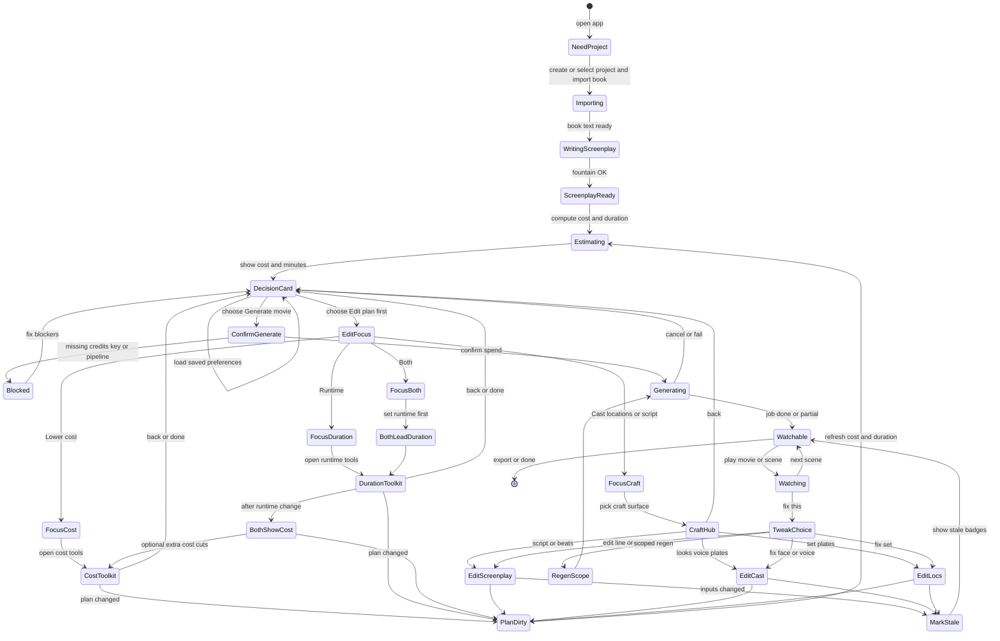

# Studio decision flow — plan & checklist

**Status:** living plan (product + engineering)  
**North star:** Generate the whole movie → watch → tweak → surgical regen.  
**Pre-gen spine:** Import → estimate (tiered) → **Decision card** → Generate **or** Edit → re-estimate → Generate.

Cost is never a hard dollar gate. Preferences bias defaults; the user always chooses.

---

## 1. Principles

| # | Principle |
|---|-----------|
| 1 | **Film is home after gen.** Craft pages (script / cast / locs) are fix tools. |
| 2 | **Cost + duration are forecasts** on the current plan, not a final invoice. |
| 3 | **Estimate fidelity improves** (screenplay → shot plan → remaining). Never block the decision card waiting for perfect clip count. |
| 4 | **Generate vs Edit** is the only pre-gen fork. No forced cast→locs→trim tour. |
| 5 | **Edit focus** (cost / duration / both / craft) chooses tool order, not different physics. Cost and duration are correlated. |
| 6 | **Remember choices** (path, focus, runtime target); still show $ + minutes every time. |
| 7 | **Surgical regen + stale markers** are how the product ages when full gen is cheap. |

---

## 2. Progressive costing model

### Catch-22 (resolved)

Exact video $ needs clip count; clip count needs a shot plan; shot plan and scene count depend on runtime/cast choices that users make *because of* cost.  

**Resolution:** show a **tiered estimate** with **basis + confidence**. Re-enter `Estimating` after every material plan change.

### Estimate tiers

| Tier / basis | When | Duration source | Cost source | Confidence |
|--------------|------|-----------------|-------------|------------|
| `none` | Before usable screenplay | — | Planning LLM only (rough) | Very low — don’t use as DecisionCard primary |
| `screenplay` | Fountain ready, no shot plan | Natural runtime / scene heuristics / target if set | Synthetic clips: `f(scenes, target_min, avg_clip_sec) × $/clip` + LLM planning | **Rough band** — DecisionCard OK |
| `shot_plan` | Stage‑2 blueprint has clips | Sum of planned clip durations | Real clip count × model rates | **Good** pre-gen |
| `remaining` | Gen in progress or partial | Actual + planned missing | Spent ledger + missing clips | **Best** operational |

Implementation note (current engine): `CostReportService` already sets `EstimateBasis` to `shot_plan` or falls back to screenplay-derived clips (`screenplay`). Decision UI must **surface basis** and prefer **ranges** on `screenplay`.

### What moves the forecast

| Change | Duration | Video $ | Plates $ |
|--------|----------|---------|----------|
| Runtime target / trim / fit | Yes | Yes (clips scale) | Small |
| Cast size / speaking cast | Small | Small–medium | Yes |
| Location plates | No | No (attach only) | Yes (gen plates) |
| Resolution (480/720/1080) | No | Yes | No |
| Shot plan refine | Yes (exact) | Yes (exact) | — |
| Gen some clips | Actual media | Spent ↑ remaining ↓ | — |

### DecisionCard always shows

```text
~{duration_label}  ·  ~${cost_label}  ·  basis: {screenplay|shot_plan|remaining}
[ Generate movie ]    [ Edit plan first ]
```

Optional: low–high band when basis is `screenplay`.

---

## 3. State machine

### Happy path (summary)

```text
Import → WritingScreenplay → Estimating(tier) → DecisionCard
    ├─ Generate → ConfirmGenerate → Generating → Watchable ⇄ Tweak/Regen
    └─ Edit → EditFocus → toolkit → PlanDirty → Estimating → DecisionCard
```

### Full state diagram



### Edit focus (cost / duration / both / craft)

| Focus | Entry order | Tools |
|-------|-------------|--------|
| **Cost** | Cost toolkit first | Trim scenes, cast cap, draft resolution, drop extras |
| **Duration** | Runtime toolkit first | Target minutes, fit/trim, expand |
| **Both** | **Duration first**, then show new $, optional cost toolkit | Same tools; correlated messaging |
| **Craft** | Script / Cast / Locs | Identity & story; re-estimate if plan/runtime changed |

### Preferences (side memory — not states)

| Key | Effect |
|-----|--------|
| `preferPath` = generate \| edit | Primary button emphasis on DecisionCard |
| `editFocus` = cost \| duration \| both \| craft | Pre-select EditFocus |
| `lastRuntimeTargetMin` | Prefill duration toolkit |
| `skipEditFocus` (optional) | Edit → last toolkit directly |

Never auto-spend without explicit Generate (unless a future opt-in “always generate after import”).

### Explicit non-goals

- No hard $20 (or any) autopilot threshold  
- No forced full cast/loc polish before first Generate  
- No separate cost vs duration “physics” — one plan, two intents  

---

## 4. Checklist

Use this as the build/acceptance tracker. Check items off in PRs; leave dates/notes in the “Notes” column when useful.

### Phase A — Estimate honesty (costing model)

| Done | Item | Notes |
|:----:|------|-------|
| | **A1** Document estimate tiers in API (`basis`, duration, cost low/point/high, clipSource) | Align with `CostReportService` basis |
| | **A2** Screenplay-tier estimate always available when fountain exists | Already partial via screenplay-derived clips |
| | **A3** Decision-facing payload: duration label + cost label + basis + confidence | |
| | **A4** Re-estimate endpoint/hook after trim, runtime target, cast cap, resolution | |
| | **A5** Remaining estimate while gen runs (spent + missing) | Ledger path exists; wire to Film |
| | **A6** UI copy: “forecast on current plan,” not final invoice | |

### Phase B — Decision card (pre-gen hub)

| Done | Item | Notes |
|:----:|------|-------|
| | **B1** Post-import / post-estimate **DecisionCard**: ~min · ~$ · basis | Primary UX |
| | **B2** Actions: **Generate movie** \| **Edit plan first** | No third maze |
| | **B3** Load prefs for emphasis only; always show card | |
| | **B4** ConfirmGenerate: one confirm with current $ + min | |
| | **B5** Blocked state: credits / keys / pipeline with return to card | |
| | **B6** If shot plan missing on Generate: run plan as first job step or estimate-only then plan | Product choice — document in PR |

### Phase C — Edit focus + toolkits

| Done | Item | Notes |
|:----:|------|-------|
| | **C1** EditFocus question: cost / duration / both / craft | |
| | **C2** Cost toolkit entry + back to DecisionCard | |
| | **C3** Duration toolkit entry + back to DecisionCard | |
| | **C4** Both = duration-lead then optional cost | |
| | **C5** Craft hub → script / cast / locs; PlanDirty when needed | |
| | **C6** Persist `preferPath`, `editFocus`, `lastRuntimeTargetMin` | User and/or project |

### Phase D — Watch → edit (post-gen hub)

| Done | Item | Notes |
|:----:|------|-------|
| [x] | **D1** Film scene: Edit script · Fix cast · Fix location deep links | `556e8ee0` StudioDeepLinks |
| [x] | **D2** `?char=` / `?loc=` / screenplay `?scene=` selection | same |
| [x] | **D3** Character/Location modals → full Cast/Locs with focus | same |
| | **D4** Clip-level: edit line · fix speaker · regen clip | |
| | **D5** Return to same scene after craft edit (optional regen prompt) | |
| | **D6** Movie readiness strip: total / on disk / missing / stale | |

### Phase E — Surgical regen & identity

| Done | Item | Notes |
|:----:|------|-------|
| [x] | **E1** Location plates attach to video (soft) + scene fallback | location pipeline |
| [x] | **E2** Character ref images on video | existing |
| | **E3** StableBeatId write-through + UI beat↔clip | backend partial |
| | **E4** Regen scopes: clip · scene · missing · stale · full (+ cost per scope) | |
| | **E5** Stale detection: script/plate/prompt version vs last gen | |
| | **E6** Badge + regen stale in scene / all stale | |

### Phase F — Durable full-film jobs

| Done | Item | Notes |
|:----:|------|-------|
| | **F1** Generate movie = one resumable job across scenes | harden existing |
| | **F2** Watch partials while job runs | |
| | **F3** Cancel / reconnect without losing finished clips | ongoing |
| | **F4** Fill holes (missing only) as default “cheap full finish” | |

### Phase G — Preferences & polish

| Done | Item | Notes |
|:----:|------|-------|
| | **G1** User prefs store for path/focus/runtime | |
| | **G2** Optional “don’t ask focus again” | |
| | **G3** Soften first-watch cast lock for draft mode (plates optional) | cost mode later |
| | **G4** Budget/draft vs full as **mode**, not separate app | when economics need it |

---

## 5. Suggested build order

```text
1. A3 + B1–B4   DecisionCard with honest tiered estimate
2. C1–C6        Edit focus + prefs + re-estimate loop
3. D4–D6        Clip fix + movie strip
4. E3–E6        Beat map + scopes + stale
5. F*           Full-film job polish
6. G*           Draft/full modes as needed
```

---

## 6. Acceptance — “we’re there”

1. Import book → see **duration + cost forecast + basis** without waiting for a perfect shot plan.  
2. Choose **Generate** or **Edit** (with optional focus).  
3. Edit → numbers refresh → Generate again.  
4. Watch the cut on Film.  
5. Fix line / face / set from the scene you watched.  
6. See **stale** when inputs change; **regen clip/scene** without full re-run.  
7. When gen is cheap, default scope slides to full film; UI spine unchanged.

---

## 7. Related code (anchors)

| Area | Location |
|------|----------|
| Cost basis / screenplay fallback | `host/PageToMovie.Engine/CostReportService.cs` |
| Cost page / agree continue | `host/PageToMovie.Web/Components/Pages/Cost.razor` |
| Deep links watch→edit | `host/PageToMovie.Web/Services/StudioDeepLinks.cs` |
| Film scene edit hub | `host/PageToMovie.Web/Components/Pages/Scenes.SceneDetail.razor` |
| Readiness gates | `host/PageToMovie.Web/Services/ActiveProjectState.cs` |
| Studio strip | `StudioProcessStrip` (shared component) |

---

*Last updated: 2026-08-11 — progressive costing + DecisionCard plan checked in.*
