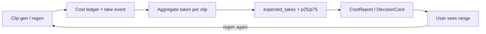
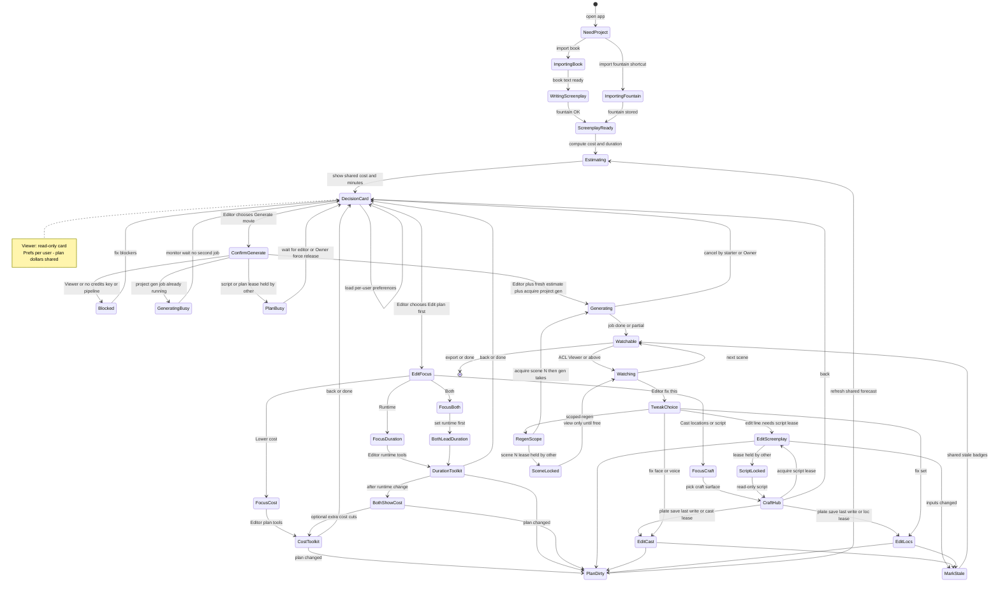

# Studio decision flow — plan & checklist

**Status:** living plan (product + engineering)  
**North star:** Generate the whole movie → watch → tweak → surgical regen.  
**Pre-gen spine:** Import (**book** *or* **fountain shortcut**) → estimate (tiered) → **Decision card** → Generate **or** Edit → re-estimate → Generate.  
**Multi-user:** one project, shared plan/clips/ledger; roles + scene/script leases gate who can change what.

Cost is never a hard dollar gate. Preferences bias defaults; the user always chooses.

---

## 1. Principles

| # | Principle |
|---|-----------|
| 1 | **Film is home after gen.** Craft pages (script / cast / locs) are fix tools. |
| 2 | **Cost + duration are forecasts** on the current plan, not a final invoice. |
| 3 | **Estimate fidelity improves** (screenplay → shot plan → remaining). Never block the decision card waiting for perfect clip count. |
| 4 | **Generate vs Edit** is the only pre-gen fork. No forced cast→locs→trim tour. |
| 5 | **Edit focus** (cost / duration / both / craft) chooses tool order, not different physics. Cost and duration are correlated. |
| 6 | **Remember choices** (path, focus, runtime target) **per user**; project forecast is shared. Still show $ + minutes every time. |
| 7 | **Surgical regen + stale markers** are how the product ages when full gen is cheap. |
| 8 | **Regen feedback loop** — measure real takes-per-clip and reasons so estimates (and ranges) improve with usage. |
| 9 | **Two import paths:** book→screenplay *or* **import fountain** (skip write) — both land on the same DecisionCard. |
| 10 | **Shared projects:** Owner / Editor / Viewer + leases on `script` / `scene:N` / gen jobs; one movie, concurrent people. |

---

## 2. Progressive costing model

### Catch-22 (resolved)

Exact video $ needs clip count; clip count needs a shot plan; shot plan and scene count depend on runtime/cast choices that users make *because of* cost.  

**Resolution:** show a **tiered estimate** with **basis + confidence**. Re-enter `Estimating` after every material plan change.

### Estimate tiers

| Tier / basis | When | Duration source | Cost source | Confidence |
|--------------|------|-----------------|-------------|------------|
| `none` | Before usable screenplay | — | Planning LLM only (rough) | Very low — don’t use as DecisionCard primary |
| `screenplay` | Fountain ready, no shot plan | Natural runtime / scene heuristics / target if set | Synthetic clips: `f(scenes, target_min, avg_clip_sec) × $/clip` + LLM planning | **Rough band** — DecisionCard OK |
| `shot_plan` | Stage‑2 blueprint has clips | Sum of planned clip durations | Real clip count × model rates | **Good** pre-gen |
| `remaining` | Gen in progress or partial | Actual + planned missing | Spent ledger + missing clips | **Best** operational |

Implementation note (current engine): `CostReportService` already sets `EstimateBasis` to `shot_plan` or falls back to screenplay-derived clips (`screenplay`). Decision UI must **surface basis** and prefer **ranges** on `screenplay`.

### What moves the forecast

| Change | Duration | Video $ | Plates $ |
|--------|----------|---------|----------|
| Runtime target / trim / fit | Yes | Yes (clips scale) | Small |
| Cast size / speaking cast | Small | Small–medium | Yes |
| Location plates | No | No (attach only) | Yes (gen plates) |
| Resolution (480/720/1080) | No | Yes | No |
| Shot plan refine | Yes (exact) | Yes (exact) | — |
| Gen some clips | Actual media | Spent ↑ remaining ↓ | — |
| **User regen (N takes)** | No | **× takes factor** | — |

### DecisionCard always shows

```text
~{duration_label}  ·  ~${cost_label}  ·  basis: {screenplay|shot_plan|remaining}
[ Generate movie ]    [ Edit plan first ]
```

Optional: low–high band when basis is `screenplay`.

### Cost formula (point + range)

```text
point_$ ≈ clips × $/clip × expected_takes
low_$   ≈ clips × $/clip × takes_p25   (or 1.0 if cold start)
high_$  ≈ clips × $/clip × takes_p75   (or default_prior if cold start)
```

| Term | Source |
|------|--------|
| `clips` | Tier: synthetic or shot plan |
| `$/clip` | Model catalog rates × resolution |
| `expected_takes` | **Learned** from regen telemetry (global → segment → project), else prior (e.g. QA mult ~1.3) |
| Range | Percentiles of takes/clip, not a guessy ±% only |

**Cold start prior** (until enough samples): use existing QA/history path (`qa_retry_video_multiplier` / `BuildHistoryRefinementAsync` in `CostReportService`) as `expected_takes`. Replace/blend as regen events accumulate.

---

## 2b. Regen feedback loop (learn real cost)

### Why

First-pass estimate undercounts if people typically regen scenes 2–3×.  
Tracking **how often and why** people regenerate turns “we think 1.0×” into “p50 is 1.4×, dialogue scenes 1.8×” and tightens DecisionCard ranges over time.

Related but different:

| System | Learns | Feeds |
|--------|--------|--------|
| [learning_loop.md](./learning_loop.md) | *What* was wrong (prompts, stage1/2) | Better next plan/render quality |
| **Regen cost loop (here)** | *How many takes* and cost impact | Better $ forecasts / ranges |
| QA auto-retry (existing) | Fail rates → video multiplier | Automatic quality regens |

### Events to log (every video take)

Write one durable row per successful (or billed) clip generation:

| Field | Example |
|-------|---------|
| `project_id`, `user_id` (hash ok) | |
| `scene`, `clip`, `stable_beat_id?` | |
| `take_index` | 1 = first gen, 2+ = regen |
| `trigger` | `initial` \| `user_regen` \| `stale_regen` \| `qa_auto` \| `fill_holes` |
| `reason` | optional: `dialogue` \| `look` \| `motion` \| `audio` \| `other` \| null |
| `model`, `resolution` | |
| `list_usd`, `duration_sec` | from ledger |
| `had_char_refs`, `had_loc_ref` | bools |
| `minutes_since_prev_take` | |
| `ts` | |

Aggregate offline or on a schedule (not every request if heavy):

| Metric | Grain |
|--------|--------|
| `takes_per_clip` mean / p25 / p50 / p75 | global |
| same | by `trigger`, model, resolution |
| same | by scene type heuristic later (dialogue-heavy vs action) |
| `regen_rate` = share of clips with take_index ≥ 2 | global / weekly |
| `user_regen_rate` vs `qa_auto_rate` | separate — user taste vs gate |

### How estimates consume it

```text
CostReportService / DecisionCard:
  prior_takes = history QA mult (existing)
  learned_takes = telemetry.p50_takes (min N samples)
  expected_takes = blend(prior, learned, weight=f(N))
  point = clips × rate × expected_takes
  range = clips × rate × [p25, p75]  (floor low at 1.0× first-pass)
```

Show on DecisionCard when range is wide:

```text
~$32–$58  ·  typical ~1.5 takes/clip from studio history  ·  basis: shot_plan
```

Admin later: chart takes/clip over time, top regen reasons (if collected).

### Privacy / product rules

- Prefer **aggregated** learning (global + optional per-user private mult); don’t leak other users’ projects.  
- Reason codes optional (one-click after regen, not a form wall).  
- Never block gen if telemetry write fails.  
- Opt-out of “contribute to studio averages” possible later; project still gets its own remaining estimate from ledger.

### Feedback loop diagram



---

## 3. Entry paths (book vs fountain)

Both converge on **ScreenplayReady → Estimating → DecisionCard**. Fountain is a **shortcut**, not a different product.

| Path | Steps | Skips | Lands on |
|------|--------|--------|----------|
| **Book import** | Import book text → write/adapt fountain (LLM job) | — | ScreenplayReady |
| **Fountain import** | Upload / paste `.fountain` (or re-import screenplay) | WritingScreenplay job | ScreenplayReady **directly** |

```text
NeedProject
  ├─ Import book ──────────► WritingScreenplay ──► ScreenplayReady
  └─ Import fountain ────────────────────────────► ScreenplayReady   ← shortcut
                              ScreenplayReady ► Estimating ► DecisionCard ► …
```

After fountain import, cast/loc seeds and shot plan may still be missing — same as post-book: **estimate on `screenplay` basis**, then Generate (may run cast extract / stage‑2 as job steps) or Edit.

---

## 3b. Multi-user projects (how sharing fits)

### What already exists (engine)

| Concept | Implementation |
|---------|----------------|
| **ACL** | `ProjectAclDocument`: Owner, Editors[], Viewers[], pending invites (`ProjectAclService`) |
| **Roles** | `Owner` > `Editor` > `Viewer` > `None` |
| **Leases** | `IProjectLeaseService` — resource keys e.g. `project`, `scene:3`, `script` (TTL, acquire / renew / transfer; 423 on conflict) |
| **Presence** | `IProjectPresenceService` — who’s online on the project |
| **Scene lock UI** | `SceneSummary.LockOwnerUserId`, `LockedByOther` on Film list/detail |
| **Shared cost** | Project ledger / `ProjectCostAggregator` — one spend story per project |

### Policy recommendations (who decides what)

**No votes.** First successful lease + last committed artifact wins. Collab = **split by scene**, not two writers on one scene.

#### Roles

| Role | Decides / may do | May not |
|------|------------------|---------|
| **Owner** | Everything an Editor can; ACL invites/roles; **billing / API-key policy** for the project; **break-glass** force-release lease; **cancel any gen job** | — |
| **Editor** | DecisionCard **Generate** or **Edit**; plan/craft/regen when lease acquired; cancel **jobs they started** | Change ACL; steal lease (unless Owner) |
| **Viewer** | Watch, read $ forecast, review | Spend, edit plan, acquire leases, Generate |

**P1 — Generate authority:** any **Editor** (not Owner-only). Social “who is director” is outside the app.

**P2 — Billing:** project-level pool / owner policy (document in project settings). Take events still log `user_id` for attribution. *Exact key vs credits model is a settings decision; flow assumes one project wallet.*

#### Resource locks

| Resource | Lease key | Rule |
|----------|-----------|------|
| Screenplay / structure (reorder, delete scene) | `script` | One writer; others read-only |
| Scene edit + clip regen | `scene:N` | One Editor per scene; others watch |
| Full-film / fill-holes job | `project:gen` (or job mutex) | **One active movie-level gen** per project |
| Cast plate lock (optional v1.1) | `cast:{key}` | Short TTL during save/lock; else last lock wins |
| Loc plate lock (optional v1.1) | `loc:{key}` | Same |

#### Conflict → resolution

| Conflict | Resolution |
|----------|------------|
| A holds `scene:12`, B opens 12 | B: **SceneLocked** — watch OK; edit/regen disabled until release/timeout; Owner may force-release |
| A and B both **Generate movie** | First acquires `project:gen` → **Generating**; second → **GeneratingBusy** (monitor only), no second bill |
| A editing plan (`script` or toolkit dirty), B **ConfirmGenerate** | **PlanBusy** — block gen with “X is editing the plan”; B retries after release + fresh estimate |
| B’s DecisionCard open while A trims | ConfirmGenerate **always re-fetches estimate**; soft banner if plan rev changed |
| A regens clip, B watching | Last successful take wins on disk; `take_index++`; B soft-refreshes |
| A and B different scenes | **Allowed** — parallel `scene:N` leases |
| Cancel job | Starter or **Owner**; others see progress only |
| Force-steal lease | **Owner only**, with confirm (or wait for TTL) |
| Cast/loc plate two locks | v1: last write wins; v1.1: short per-key lease |
| Prefers Generate vs Edit | **Not a conflict** — per-user chrome; shared $ |

#### DecisionCard under multi-user

- **One project forecast** (basis, clips, spent, remaining, rev).  
- **Per-user chrome:** primary button from *their* `preferPath`; optional presence (“Also online: …”).  
- **Confirm Generate:** re-estimate; ACL ≥ Editor; not Viewer; not `project:gen` busy; not plan/script busy.  
- **Edit:** ACL ≥ Editor; acquire lease before mutate; release on leave/timeout.

#### Regen telemetry (multi-user)

- Take events include `user_id`.  
- **Project** calibration shared by collaborators; **global** averages anonymized (Phase H).  
- Prefs never cross users.

#### Fit into the state machine (guards)

| Transition | Guard (policy) |
|------------|----------------|
| DecisionCard Generate/Edit enabled | ACL ≥ Editor (Viewer: read-only card) |
| → EditScreenplay / structure PlanDirty | ACL ≥ Editor + acquire `script` |
| → Cost/Duration toolkits | ACL ≥ Editor (+ soft plan lock / `script` if mutating structure) |
| → ConfirmGenerate | ACL ≥ Editor + **fresh estimate** + not PlanBusy + not GeneratingBusy |
| → Generating (full film) | acquire `project:gen` |
| → RegenScope scene N | ACL ≥ Editor + acquire `scene:N` |
| → Watching | ACL ≥ Viewer |
| Cancel Generating | job starter or Owner |
| Force release lease | Owner only |

---

## 4. State machine

### Happy path (summary)

```text
Import book → WritingScreenplay ─┐
Import fountain (shortcut) ──────┴► ScreenplayReady → Estimating → DecisionCard
    ├─ Generate → ConfirmGenerate → [guards] → Generating → Watchable ⇄ Tweak/Regen
    └─ Edit → EditFocus → toolkit → PlanDirty → Estimating → DecisionCard
         Guards: ACL · script/scene/project:gen leases · one full-film job · fresh $
```

### Full state diagram (with multi-user policy)



### Guard detail (same diagram, tabular)

```text
ConfirmGenerate
  ├─ ACL < Editor                    → Blocked
  ├─ project:gen held / job running  → GeneratingBusy
  ├─ script lease held by other
  │    OR unsaved plan dirty by other → PlanBusy
  ├─ re-fetch estimate fails / $0 unknown → Blocked or wait Estimating
  └─ else acquire project:gen        → Generating

RegenScope(scene N)
  ├─ ACL < Editor          → Blocked (or hide)
  ├─ scene:N held by other → SceneLocked → Watching
  └─ else acquire scene:N  → Generating (clip/scene scope)

EditScreenplay
  ├─ acquire script OK → edit → PlanDirty
  └─ held by other     → ScriptLocked (read-only)

Parallel OK: user A scene:3 + user B scene:7
Not OK: two full-film gens; two writers on script; two regens same scene
```

### Edit focus (cost / duration / both / craft)

| Focus | Entry order | Tools |
|-------|-------------|--------|
| **Cost** | Cost toolkit first | Trim scenes, cast cap, draft resolution, drop extras |
| **Duration** | Runtime toolkit first | Target minutes, fit/trim, expand |
| **Both** | **Duration first**, then show new $, optional cost toolkit | Same tools; correlated messaging |
| **Craft** | Script / Cast / Locs | Identity & story; re-estimate if plan/runtime changed |

### Preferences (side memory — not states)

| Key | Scope | Effect |
|-----|--------|--------|
| `preferPath` = generate \| edit | **Per user** | Primary button emphasis on DecisionCard |
| `editFocus` = cost \| duration \| both \| craft | **Per user** | Pre-select EditFocus |
| `lastRuntimeTargetMin` | Per user (optional project default) | Prefill duration toolkit |
| `skipEditFocus` (optional) | Per user | Edit → last toolkit directly |

**Project-shared:** plan, estimate, clips, ledger, stale flags.  
**User-private:** DecisionCard emphasis, edit focus memory.

Never auto-spend without explicit Generate (unless a future opt-in “always generate after import”).

### Explicit non-goals

- No hard $20 (or any) autopilot threshold  
- No forced full cast/loc polish before first Generate  
- No separate cost vs duration “physics” — one plan, two intents  
- No per-user private “fork” of the cut by default (collab edits one movie; fork is a separate product action if needed)

---

## 5. Checklist

Use this as the build/acceptance tracker. Check items off in PRs; leave dates/notes in the “Notes” column when useful.

### Phase A — Estimate honesty (costing model)

| Done | Item | Notes |
|:----:|------|-------|
| | **A1** Document estimate tiers in API (`basis`, duration, cost low/point/high, clipSource) | Align with `CostReportService` basis |
| | **A2** Screenplay-tier estimate always available when fountain exists | Book **or** fountain import |
| | **A3** Decision-facing payload: duration label + cost label + basis + confidence | |
| | **A4** Re-estimate endpoint/hook after trim, runtime target, cast cap, resolution | |
| | **A5** Remaining estimate while gen runs (spent + missing) | Ledger path exists; wire to Film |
| | **A6** UI copy: “forecast on current plan,” not final invoice | |

### Phase B — Decision card (pre-gen hub)

| Done | Item | Notes |
|:----:|------|-------|
| | **B1** Post-import / post-estimate **DecisionCard**: ~min · ~$ · basis | After book write **or** fountain shortcut |
| | **B2** Actions: **Generate movie** \| **Edit plan first** | No third maze |
| | **B3** Load **per-user** prefs for emphasis only; always show card | Shared $ is project-level |
| | **B4** ConfirmGenerate: one confirm with current $ + min | |
| | **B5** Blocked state: credits / keys / pipeline / ACL with return to card | |
| | **B6** If shot plan missing on Generate: run plan as first job step or estimate-only then plan | Product choice — document in PR |
| | **B7** Fountain import CTA on import surfaces → same DecisionCard | Shortcut path |

### Phase C — Edit focus + toolkits

| Done | Item | Notes |
|:----:|------|-------|
| | **C1** EditFocus question: cost / duration / both / craft | |
| | **C2** Cost toolkit entry + back to DecisionCard | |
| | **C3** Duration toolkit entry + back to DecisionCard | |
| | **C4** Both = duration-lead then optional cost | |
| | **C5** Craft hub → script / cast / locs; PlanDirty when needed | |
| | **C6** Persist `preferPath`, `editFocus`, `lastRuntimeTargetMin` **per user** | |

### Phase D — Watch → edit (post-gen hub)

| Done | Item | Notes |
|:----:|------|-------|
| [x] | **D1** Film scene: Edit script · Fix cast · Fix location deep links | `556e8ee0` StudioDeepLinks |
| [x] | **D2** `?char=` / `?loc=` / screenplay `?scene=` selection | same |
| [x] | **D3** Character/Location modals → full Cast/Locs with focus | same |
| | **D4** Clip-level: edit line · fix speaker · regen clip | |
| | **D5** Return to same scene after craft edit (optional regen prompt) | |
| | **D6** Movie readiness strip: total / on disk / missing / stale | |

### Phase E — Surgical regen & identity

| Done | Item | Notes |
|:----:|------|-------|
| [x] | **E1** Location plates attach to video (soft) + scene fallback | location pipeline |
| [x] | **E2** Character ref images on video | existing |
| | **E3** StableBeatId write-through + UI beat↔clip | backend partial |
| | **E4** Regen scopes: clip · scene · missing · stale · full (+ cost per scope) | |
| | **E5** Stale detection: script/plate/prompt version vs last gen | |
| | **E6** Badge + regen stale in scene / all stale | |

### Phase F — Durable full-film jobs

| Done | Item | Notes |
|:----:|------|-------|
| | **F1** Generate movie = one resumable job across scenes | harden existing |
| | **F2** Watch partials while job runs | |
| | **F3** Cancel / reconnect without losing finished clips | ongoing |
| | **F4** Fill holes (missing only) as default “cheap full finish” | |
| | **F5** Multi-user: don’t start duplicate full-film gen; second user monitors | |

### Phase G — Preferences & polish

| Done | Item | Notes |
|:----:|------|-------|
| | **G1** User prefs store for path/focus/runtime | **Not** project-global |
| | **G2** Optional “don’t ask focus again” | |
| | **G3** Soften first-watch cast lock for draft mode (plates optional) | cost mode later |
| | **G4** Budget/draft vs full as **mode**, not separate app | when economics need it |

### Phase H — Regen feedback → better estimates

| Done | Item | Notes |
|:----:|------|-------|
| | **H1** Emit **take event** on every billed clip gen (initial + regen) | include `user_id` for multi-user |
| | **H2** Distinguish `user_regen` vs `qa_auto` vs `stale_regen` vs `fill_holes` | |
| | **H3** Optional one-click **reason** after user regen (dialogue / look / motion / audio / other) | no modal wall |
| | **H4** Aggregate: takes/clip mean + p25/p50/p75 (global; min sample size) | |
| | **H5** Blend learned `expected_takes` into CostReport (with existing QA history mult as prior) | `BuildHistoryRefinementAsync` |
| | **H6** DecisionCard / Cost UI: show **range** driven by p25–p75 takes when N sufficient | |
| | **H7** Admin: regen rate dashboard (takes/clip over time, by trigger) | |
| | **H8** Per-project: actual takes so far vs estimate (calibration feedback) | shared by collaborators |
| | **H9** Privacy: aggregates only for studio-wide learning; fail-open if telemetry down | |

### Phase I — Multi-user collab (fit into flow)

| Done | Item | Notes |
|:----:|------|-------|
| [x] | **I0** ACL Owner/Editor/Viewer + invites | `ProjectAclService` exists |
| [x] | **I0b** Leases `script` / `scene:N` + Film `LockedByOther` | `IProjectLeaseService` exists |
| [x] | **I0c** Policy doc: any Editor gens; one `project:gen`; PlanBusy; Owner break-glass | §3b recommendations |
| | **I1** DecisionCard respects ACL (Viewer read-only) | |
| | **I2** ConfirmGenerate → **GeneratingBusy** if full-film job running | no double bill |
| | **I3** ConfirmGenerate → **PlanBusy** if `script`/plan held by other | block gen until free |
| | **I4** ConfirmGenerate always **re-fetches estimate** | stale $ banner if rev changed |
| | **I5** Edit script acquires/releases `script`; **ScriptLocked** UI | |
| | **I6** Scene edit/regen acquires `scene:N`; deep links honor lock | |
| | **I7** Cancel job: starter or Owner only | |
| | **I8** Owner force-release lease (confirm) | |
| | **I9** Presence strip on DecisionCard / Film | optional polish |
| | **I10** Shared estimate refresh when collaborator PlanDirties | SignalR or poll |
| | **I11** Take events + ledger attribution under concurrent editors | H1 multi-user |
| | **I12** Docs/QA: two-user matrix (watch / edit / gen / lock / PlanBusy) | |
| | **I13** Optional `cast:{key}` / `loc:{key}` short leases on plate lock | v1.1; else last-write |
| | **I14** Project billing/key policy surface (Owner) | P2 settings |


---

## 6. Suggested build order

```text
1. A3 + B1–B4 + B7   DecisionCard + fountain shortcut landing
2. C1–C6             Edit focus + per-user prefs + re-estimate loop
3. I1–I8             ACL + PlanBusy + GeneratingBusy + leases (policy in §3b)
4. D4–D6             Clip fix + movie strip
5. H1–H2             Take events early (so data accrues; include user_id)
6. E3–E6             Beat map + scopes + stale
7. H4–H6             Aggregates → expected_takes → ranges
8. F* + I2           Full-film job polish + no double gen
9. H3, H7–H9, I9–I14 Reasons, admin, presence, billing policy, collab QA
10. G*               Draft/full modes as needed
```

**Why H early:** telemetry only helps after volume. Log takes as soon as gen path is stable; wire into $ later.

---

## 7. Acceptance — “we’re there”

1. Import **book** *or* **fountain** → see **duration + cost forecast + basis** without waiting for a perfect shot plan.  
2. Choose **Generate** or **Edit** (with optional focus).  
3. Edit → numbers refresh → Generate again.  
4. Watch the cut on Film.  
5. Fix line / face / set from the scene you watched.  
6. See **stale** when inputs change; **regen clip/scene** without full re-run.  
7. Estimates use **learned takes/clip** (range shrinks as studio volume grows).  
8. **Two users** on one project: Viewer watches; Editor regenerates under `scene:N`; other sees SceneLocked; second Generate → GeneratingBusy; plan edit blocks gen via PlanBusy; one shared $ forecast.  
9. When gen is cheap, default scope slides to full film; UI spine unchanged.

---

## 8. Related code (anchors)

| Area | Location |
|------|----------|
| Cost basis / screenplay fallback | `host/PageToMovie.Engine/CostReportService.cs` |
| QA / history video multiplier | `CostReportService.BuildHistoryRefinementAsync` |
| Cost page / agree continue | `host/PageToMovie.Web/Components/Pages/Cost.razor` |
| Deep links watch→edit | `host/PageToMovie.Web/Services/StudioDeepLinks.cs` |
| Film scene edit hub | `host/PageToMovie.Web/Components/Pages/Scenes.SceneDetail.razor` |
| Readiness gates | `host/PageToMovie.Web/Services/ActiveProjectState.cs` |
| ACL / invites | `host/PageToMovie.Engine/Collaboration/ProjectAclService.cs` |
| Leases | `host/PageToMovie.Engine/Collaboration/ProjectLeaseService.cs` (`project` \| `scene:N` \| `script`) |
| Presence | `host/PageToMovie.Engine/Collaboration/IProjectPresenceService.cs` |
| Scene lock fields | `SceneSummary.LockOwnerUserId`, `LockedByOther` |
| Quality / prompt learning (separate) | [docs/learning_loop.md](./learning_loop.md) |
| API cost history stats | `UserDatabaseService.GetApiCostHistoryStatsAsync` |

---

*Last updated: 2026-08-11 — multi-user policy recommendations in diagram (PlanBusy, GeneratingBusy, ScriptLocked, project:gen); fountain shortcut; regen feedback Phase H.*

